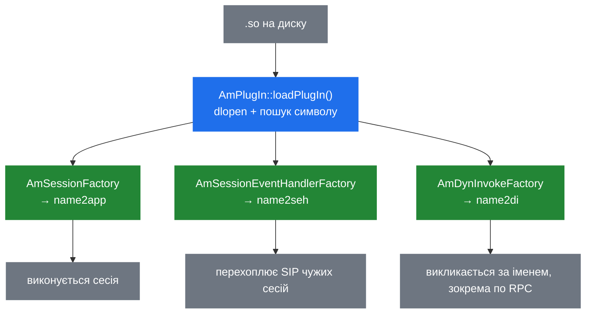

# 7.1 Архітектура плагінів

> [!NOTE]
> Майже нічого в SEMS не лежить у самому бінарнику SEMS. Застосунки, кодеки, RPC-транспорти,
> бекенди логування і движок DSM — усе це shared object'и, які на старті завантажує `AmPlugIn`.
> Ядро є фреймворком; усе, що ви справді розгортаєте, — плагіни.

## П'ять реєстрів

`AmPlugIn` — сінглтон, що знає, хто завантажений, і його приватні поля є доброю картою того, чим
плагін може бути:

```cpp
class AmPlugIn : public AmPayloadProvider
{
  std::map<int,amci_codec_t*>       codecs;
  std::map<int,amci_payload_t*>     payloads;
  std::map<string,amci_inoutfmt_t*> file_formats;

  std::map<string,AmSessionFactory*>             name2app;
  std::map<string,AmSessionEventHandlerFactory*> name2seh;
  std::map<string,AmPluginFactory*>              name2base;
  std::map<string,AmDynInvokeFactory*>           name2di;
  std::map<string,AmLoggingFacility*>            name2logfac;

  std::map<string,AmPluginFactory*>              module_objects;
};
```

Дві родини. Мапи `amci_*` — це C-інтерфейс кодеків ([5.4](19-codecs-and-plugins.md)) із ключем за
цілим типом payload. Мапи `name2*` — система плагінів на C++ із ключем за іменем.

| Реєстр | Тримає | Розділ |
|---|---|---|
| `name2app` | Застосунки — те, що створює сесії | [4.2](13-session-container-and-factories.md) |
| `name2seh` | Обробники подій сесії — перехоплювачі | [4.4](15-session-event-handlers.md) |
| `name2di` | DI-об'єкти — викликні модулі | [8.1](28-rpc-architecture.md) |
| `name2logfac` | Засоби логування | — |
| `name2base` | Прості плагіни без жодної з ролей вище | — |

`module_objects` стоїть окремо й тримає живими самі об'єкти фабрик, незалежно від того, який
реєстр ролей на них вказує. Один `.so` може зареєструватись у кількох — `uac_auth` є і
обробником подій сесії, і DI-інтерфейсом, тож з'являється двічі.

## Завантаження

```cpp
  void init();
  int load(const string& directory, const string& plugins);

  int loadPlugIn(const string& file, const string& plugin_name, vector<AmPluginFactory*>& plugins);
  int loadAudioPlugIn(amci_exports_t* exports);
  int loadAppPlugIn(AmPluginFactory* cb);
  int loadSehPlugIn(AmPluginFactory* cb);
  int loadBasePlugIn(AmPluginFactory* cb);
  int loadDiPlugIn(AmPluginFactory* cb);
  int loadLogFacPlugIn(AmPluginFactory* f);
```

`load()` бере теку й необов'язковий явний список. Зі списком завантажуються лише перелічені й
саме в цьому порядку; без нього тека сканується. `loadPlugIn()` робить `dlopen` файлу й шукає
символи, які створюють макроси `EXPORT_*` ([4.2](13-session-container-and-factories.md)), а далі
диспетчерить у потрібний `load*PlugIn()` залежно від знайденого символу.

Коли порядок заданий явно, він має значення. Плагін, чий `onLoad()` потребує вже
зареєстрованого іншого модуля — скажімо, `dsm`, що тягнеться по `mod_mysql`, — мусить іти після
нього.

> [!IMPORTANT]
> Ненульове повернення з `onLoad()` валить плагін, а невдалий плагін валить старт усього процесу
> ([2.4](05-lifecycle.md)). Це навмисно й правильно: медіа-сервер без модуля, який відповідає на
> дзвінки, не є медіа-сервером, і голосно впасти на завантаженні краще, ніж виявити це на першому
> INVITE. Це ж означає, що одруківка в конфігурації одного модуля повністю зупиняє старт.

Завантаження відбувається **після** того, як SIP-стек прив'язав сокети ([2.4](05-lifecycle.md)),
і саме тому після рестарту видно коротке вікно запитів, відхилених через відсутність застосунку.

## Реєстрація

```cpp
  bool registerFactory4App(const string& app_name, AmSessionFactory* f);

  static bool registerApplication(const string& app_name, AmSessionFactory* f);
  static bool registerSIPEventHandler(const string& seh_name, ...);
  static bool registerDIInterface(const string& di_name, AmDynInvokeFactory* f);
  static bool registerLoggingFacility(const string& lf_name, AmLoggingFacility* f);
```

Статичні варіанти існують, щоб модуль міг зареєструватись зсередини власного `onLoad()`, не
тримаючи вказівника на менеджер плагінів. Модуль, що дає кілька застосунків — SBC реєструє
більш ніж одне ім'я — кличе `registerApplication()` на кожне ім'я.

Пошук дзеркальний:

```cpp
  AmSessionFactory* getFactory4App(const string& app_name);
  AmSessionEventHandlerFactory* getFactory4Seh(const string& name);
  AmDynInvokeFactory* getFactory4Di(const string& name);
  AmLoggingFacility* getFactory4LogFaclty(const string& name);

  AmSessionFactory* findSessionFactory(const AmSipRequest& req, string& app_name);
```

`findSessionFactory()` вибивається з ряду: він бере сам запит і вихідний параметр для імені.
Його вживають, коли селектор застосунку нічого не дав
([4.2](13-session-container-and-factories.md)), і фабрики самі вирішують між собою, чи хоче
хтось цей дзвінок.

## `AmArg` — тип на межі

Плагіни є окремо скомпільованими shared object'ами, тож усе, що перетинає межу між ними,
потребує типу, про який обидва боки домовились без спільних заголовків. Цим типом є `AmArg`:

```cpp
  enum {
    Undef=0,
    Int,
    LongLong,
    Bool,
    Double,
    CStr,
    AObject, // pointer to an object not owned by AmArg
    ...
    Blob,
    Array,
    Struct
  };

  typedef std::vector<AmArg>              ValueArray;
  typedef std::map<std::string, AmArg>    ValueStruct;
```

Динамічно типізований варіант: скаляри, рядки, бінарні блоби, масиви й структури з рядковими
ключами — по суті система типів JSON, що не є збігом, зважаючи на те, що саме це маршалить
`jsonrpc` ([8.1](28-rpc-architecture.md)).

Два записи варті уваги.

**`AObject` — це вказівник на об'єкт, яким `AmArg` не володіє.** Так живий C++-об'єкт проходить
через інтерфейс, типізований `AmArg`, і це зовсім не перевіряється: приймач мусить знати, що
йому дали, і не має пережити цей об'єкт. Швидко — і готовий use-after-free, якщо час життя не
очевидний.

**`Blob` володіє своїми даними:**

```cpp
struct ArgBlob {
  ...
  ~ArgBlob() { if (data) free(data); }
};
```

`malloc`/`free`, а не `new`/`delete`, бо блоб міг приїхати з боку C.

Ціна `AmArg` у тому, що помилки стають рантайм-помилками. Індексувати структуру як масив або
прочитати `CStr` як `Int` компілюється нормально, а кидає — чи, гірше, асертить — коли приїхав
дзвінок. Старий інтерфейс call control ([6.5](23c-sbc-call-control.md)) із позиційними цілими
константами — найгостріший приклад того, скільки це коштує на практиці.

## Три способи, якими плагін бере участь



- **Застосунок** володіє дзвінками. Один INVITE, одна сесія, ваш код.
- **Обробник подій сесії** бачить чужі дзвінки, не володіючи жодним
  ([4.4](15-session-event-handlers.md)).
- **DI-об'єкт** не володіє нічим і викликається за іменем. Саме він дотягується за межі процесу:
  зареєструйте DI-інтерфейс — і він викликний по XML-RPC та JSON-RPC без жодного рядка
  транспортного коду ([8.1](28-rpc-architecture.md)).

Модуль часто робить не одне. `uac_auth` є обробником подій сесії, який робить роботу, і
DI-інтерфейсом, щоб обліковими даними можна було керувати в рантаймі.

## Кодеки — інакше

```cpp
  int addCodec(amci_codec_t* c);
  int loadAudioPlugIn(amci_exports_t* exports);
```

`AmPlugIn` успадковує `AmPayloadProvider` — інтерфейс, у якого рівень SDP питає «які payload ми
підтримуємо?» ([4.3](14-offer-answer.md)). Плагіни кодеків не реєструють фабрику; вони віддають
таблицю вказівників на функції, а `AmPlugIn` стає відповіддю на питання про payload.

Саме тут застосовується `exclude_payloads` ([5.4](19-codecs-and-plugins.md)): payload із
чорного списку не додається, тож він ніколи не потрапляє в SDP-offer.

## Конфігурація

Кожен плагін може мати власний файл у `plugin_config_path`:

```
plugin_config_path=/usr/local/etc/sems/etc/
```

`announcement.conf` для модуля `announcement` і так далі. Конвенція — за іменем, а файл читається
під час `onLoad()`, і саме тому погане значення там зупиняє старт, а не породжує попередження.

## Як написати свій

1. Успадкуйтесь від фабрики потрібної ролі — `AmSessionFactory`,
   `AmSessionEventHandlerFactory`, `AmDynInvokeFactory`.
2. Реалізуйте `onLoad()`: прочитати конфігурацію, зареєструватись, повернути 0. Повертайте
   ненуль на все, з чого не можете відновитись — падіння на старті і є задуманою поведінкою.
3. Експортуйте відповідним макросом `EXPORT_*`.
4. Зберіть `.so` у теку плагінів.
5. Якщо порядок завантаження важить — назвіть модуль явно у списку `load_plugins`.

> [!WARNING]
> Плагін — це код усередині процесу SEMS ([2.1](02-thread-model.md)). Він ділить купу, потоки й
> долю з кожним дзвінком на машині. Segfault у вашому модулі — це аварія, а не невдалий дзвінок.
> Розділ [7.4](27-app-tradeoffs.md) цілком про те, коли цей ризик виправданий, а коли краще
> скрипт.
