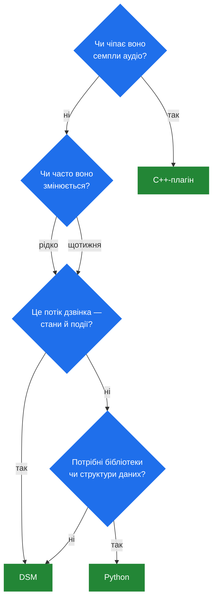

# 7.4 Компроміси: C++ vs DSM vs Python

> [!IMPORTANT]
> Увесь цей розділ тримається на одному факті: SEMS — це **один процес**
> ([2.1](02-thread-model.md)). Segfault у вашому коді застосунку — це не невдалий дзвінок, а всі
> дзвінки на машині одразу. Вибір мови тут — це переважно вибір того, скільки цього ризику ви
> берете на себе.

## Три варіанти

| | C++-плагін | DSM-скрипт | Python (`ivr` / `py_sems`) |
|---|---|---|---|
| Виконується як | Нативний код у процесі | Інтерпретована FSM у процесі | CPython у процесі |
| Цикл змін | Правка → збірка → рестарт | Правка → перезавантаження | Правка → перезавантаження |
| Баг може | **Вбити процес** | Підняти `DSMException` | Підняти виняток Python |
| Статичні перевірки | Компілятор | Перевірки діаграми на завантаженні | Жодних до виконання |
| Масштабується по ядрах | Так | Так | **Ні — GIL** |
| Виразність | Повна | Свідомо вузька | Висока |
| Доступ до медіа-шляху | Так | Ні | Ні |
| Хто може супроводжувати | C++-розробники | Експлуатація, за день навчання | Python-розробники |

## Радіус ураження

Це вісь, яка важить найбільше й обговорюється найменше.

**C++** ділить адресний простір із SIP-стеком, медіа-процесором і кожною сесією. Розіменування
нуля у вашому `onInvite()` кладе машину з тисячею дзвінків. Немає ні пісочниці, ні супервізора,
який перезапустив би саме ваш модуль.

**DSM** так не вміє. Скрипт не розіменовує вказівників; погане ім'я стану падає на завантаженні
([7.2](25-dsm.md)), а рантайм-проблема піднімає `DSMException`, який діаграма може перехопити.
Найгірший результат — один дзвінок завершився погано.

**Python** десь посередині й ближче до DSM. Неперехоплений виняток вилітає зі скрипта в
`AmSession::processEventsCatchExceptions()` ([4.1](12-amsession.md)), який завершує цю сесію й
повертає `false`. Один дзвінок помирає; сервер — ні.

> [!TIP]
> Ця локалізація реальна, і вона є найсильнішим аргументом проти написання логіки застосунку на
> C++. Лишіть C++ для того, що його справді потребує — робота на медіа-шляху, кодеки,
> критичні за швидкістю шляхи — а логіку рішень кладіть туди, звідки вона не забере процес.

## Затримка й пропускна здатність

**C++** — єдиний варіант на медіа-шляху. `AmAudio::read()` виконується всередині медіа-тика 10 мс
([5.3](18-audio-pipeline.md)), спільного з кожною сесією callgroup. Ні DSM, ні Python там бути не
можуть, і це не недогляд — інтерпретатор у тику був би катастрофою.

**DSM** виконує скомпільовану машину станів: пошук у мапі, перевірка умови, невеликий список
дій. Для «на клавішу 3 зіграти промпт 7» це вимірювано не відрізняється від C++ за будь-якої
швидкості дзвінків, яку побачить медіа-сервер.

**Python** платить накладними інтерпретатора на подію і, що важливіше, конкурує за GIL
([7.3](26-ivr-and-python.md)). Нормально для скрипта, що робить кілька десятків операцій на
дзвінок, і хибний інструмент тієї миті, коли він береться за справжню роботу.

Навантаження важить менше, ніж припускають: потік дзвінка виконує порядку десятків подій за
хвилини. Медіа-площина ж крутить 50 пакетів за секунду на напрямок і є цілком C++ незалежно від
того, чим написано ваш застосунок.

## Швидкість ітерації

**C++**: правка, збірка, рестарт. А рестарт SEMS означає drain дзвінків зі стелею у **10 секунд**
на коректну зупинку ([2.4](05-lifecycle.md)) — на машині з довгими дзвінками викотити зміну в
один рядок є операційною подією.

**DSM і Python**: перезавантаження. Без рестарту, без обірваних дзвінків. Для логіки, що
змінюється щотижня — а політика маршрутизації завжди така — це переважує все інше в таблиці.

Саме через цю різницю існує `cc_dsm` ([6.5](23c-sbc-call-control.md)): він дозволяє зробити call
control у SBC скриптом, тож зміна політики стає правкою файлу, а не вікном обслуговування.

## Коректність

**C++** має компілятор. Типи перевіряються, рефакторинги механічні, а типовий наслідок помилки —
помилка збірки.

**DSM** має щось вужче, але справді корисне — перевірки діаграми на завантаженні
([7.2](25-dsm.md)):

| Перевірка | Ловить |
|---|---|
| `checkInitialState` | Немає початкового стану або їх кілька |
| `checkDestinationStates` | Перехід у стан, якого не існує |
| `checkHangupHandled` | Стан без виходу на hangup |

Третю варто оцінити. «Стан, що не обробляє hangup» — найпоширеніший баг потоків дзвінка взагалі,
він не падає, і він тече сесією до `dead_rtp_time` через п'ять хвилин ([5.2](17-rtp-stream.md)).
DSM відмовляється таке завантажувати.

**Python** не має нічого з цього. Одруківка в рідко вживаній гілці виявляється тим дзвінком, який
у неї потрапив.

## Виразність, чесно

**C++** може все, включно з тим, чому місце деінде.

**DSM** свідомо вузький: стани, переходи, умови, дії, плюс функції, `for` по масиву чи діапазону
й винятки ([7.2](25-dsm.md)). Потоки дзвінка лягають добре. Алгоритми — ні, і DSM-скрипт, що
бореться з мовою, гірший за той C++, якого він уникав.

**Python** — справжня мова зі справжньою екосистемою бібліотек. Коли задача звучить як
«розпарсити цей JSON, викликати той API, вирішити», Python є чесною відповіддю.

Корисний сигнал: якщо діаграма потоку вміщається на дошці — правильний DSM. Якщо потрібні
структури даних — Python. Якщо треба чіпати семпли аудіо — C++.

## Як обирати

**Беріть C++, коли:** код на медіа-шляху; ви додаєте кодек ([5.4](19-codecs-and-plugins.md)); вам
потрібен обробник подій сесії, що бачить кожне повідомлення
([4.4](15-session-event-handlers.md)); або робота справді впирається в CPU.

**Беріть DSM, коли:** це потік дзвінка; експлуатація мусить міняти його без збірки; логіка — це
стани й події; або це call control у SBC, що часто змінюється.

**Беріть Python, коли:** потрібні бібліотеки чи нетривіальна робота з даними; ви прототипуєте;
або команда «пайтонівська», а потік не гарячий.

## Патерн, що знімає вибір

Найкраща відповідь часто — жоден із трьох: винести логіку **за межі процесу**.

DI-інтерфейс задарма викликний по XML-RPC і JSON-RPC ([8.1](28-rpc-architecture.md)), а SBC
постачає модуль call control `rest` ([6.5](23c-sbc-call-control.md)) саме для того, щоб політика
могла жити в сервісі, який ви розгортаєте окремо, будь-якою мовою.

Переваги — саме ті, яких не дасть ніщо всередині процесу: ваш код не може покласти SEMS, не може
тримати GIL, не може заблокувати потік сесії назавжди, і його можна викочувати, масштабувати й
відкочувати за власним графіком. Ціна — мережевий round trip у шляху встановлення дзвінка й
дисципліна таймаутів та розумної поведінки за замовчуванням при відмові.

> [!WARNING]
> Блокуючий виклик у зовнішній сервіс небезпечний, де б він не жив — потік сесії
> ([2.1](02-thread-model.md)), медіа-тик ([5.1](16-media-processor.md)) чи гачок call control у
> SBC ([6.5](23c-sbc-call-control.md)). Хоч би яку мову ви обрали, правило те саме: короткі
> таймаути, визначена поведінка при відмові й ніколи — синхронний виклик із того, що крутить
> медіа-площина.

## По одному рядку на кожен

- **C++** — для того, що мусить бути швидким або мусить чіпати медіа. Прийміть, що баг = аварія.
- **DSM** — типовий вибір для потоків дзвінка. Перезавантажується, перевіряється на завантаженні,
  не може вбити процес.
- **Python** — коли потрібна справжня мова. Слідкуйте за GIL, ловіть свої винятки.
- **Зовнішній сервіс** — коли логіка насправді взагалі не про телефонію.
