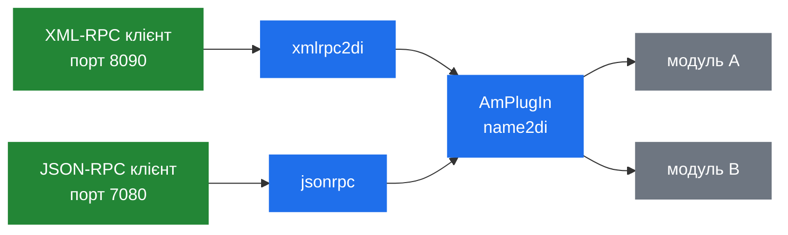

# 8.1 Архітектура RPC

> [!IMPORTANT]
> У SEMS є рівно **одна** внутрішня конвенція викликів між модулями — інтерфейс DI (dynamic
> invocation), — а RPC-транспорти є тонкими перехідниками до неї. Зареєструйте DI-інтерфейс, і
> він стане викликним по XML-RPC та JSON-RPC без жодного рядка транспортного коду.

## Увесь інтерфейс

```cpp
class AmDynInvoke
{
 public:
  /** \brief NotImplemented result for DI API calls */
  struct NotImplemented {
    string what;
    NotImplemented(const string& w)
      : what(w) {}
  };

  AmDynInvoke();
  virtual ~AmDynInvoke();
  virtual void invoke(const string& method, const AmArg& args, AmArg& ret);
};

class AmDynInvokeFactory: public AmPluginFactory
{
  virtual AmDynInvoke* getInstance()=0;
};
```

Один метод. Ім'я методу рядком, аргументи як `AmArg`, результат як `AmArg`
([7.1](24-plugin-architecture.md)).

Це свідомо мінімальний контракт, і він купує ту властивість, на якій тримається весь цей розділ:
**будь-який DI-об'єкт є викликним за іменем звідусіль**, включно з-поза меж процесу, і жоден бік
не мусить знати нічого про заголовки іншого.

`NotImplemented` **кидається**, а не повертається, для невідомого методу. Тож типова реалізація
DI — ланцюжок порівнянь рядків, що закінчується кидком:

```cpp
void MyModule::invoke(const string& method, const AmArg& args, AmArg& ret)
{
  if (method == "doSomething") { ... }
  else if (method == "doSomethingElse") { ... }
  else if (method == "_list") { ... }
  else throw AmDynInvoke::NotImplemented(method);
}
```

`_list` — конвенція для інтроспекції: модуль, який її реалізує, може розповісти, які в нього є
методи, і саме це робить RPC-консоль придатною проти сервера, якого ви не писали.

> [!TIP]
> Ціна інтерфейсу «на рядках» у тому, що все падає в рантаймі. Одруківка в імені методу,
> відсутній аргумент, `AmArg`, проіндексований не тим типом — нічого з цього не ловиться до
> самого виклику. Це та сама слабкість, що робить незручним старий інтерфейс call control у SBC
> ([6.5](23c-sbc-call-control.md)), і це ціна межі, яку можуть перетнути і C++-модулі, і
> Python-скрипти, і DSM-скрипти, і зовнішні клієнти.

## Як отримати DI-об'єкт

```cpp
  AmDynInvokeFactory* getFactory4Di(const string& di_name);
```

Фабрика шукається за іменем у `AmPlugIn` ([7.1](24-plugin-architecture.md)), далі
`getInstance()` дає об'єкт. Модуль, який хоче покликати інший модуль, робить саме це — і кожен
RPC-транспорт теж.

Зверніть увагу: `getInstance()` — рішення фабрики: модуль може віддавати один спільний об'єкт
усім або новий на кожен виклик. Більшість віддає сінглтон.

## Два транспорти



Обидва — звичайні плагіни-застосунки. Жодного немає в ядрі; якщо ви їх не завантажили, у SEMS
немає керуючого інтерфейсу взагалі.

### `xmlrpc2di`

Назва каже, що це: XML-RPC, перекладений у DI. Конфігурація коротка:

```
xmlrpc_port=8090
...
# direct_export=di_dial;registrar_client
direct_export=sbc
```

`direct_export` варто розуміти. Без нього RPC-виклик називає DI-модуль і метод — два рівні. З ним
методи перелічених модулів експортуються на **верхній рівень**, тож клієнт кличе
`sbc.postControlCmd`, а не проходить крізь непрямість. Це зручність — і це ж означає, що саме ці
методи найімовірніше досяжні для кожного, хто знайде порт.

Плагін несе вендорений `xmlrpc++` із локальним патчем (`xmlrpcpp07_sems.patch`) і
`MultithreadXmlRpcServer` зверху, бо оригінальна бібліотека однопотокова.

### `jsonrpc`

Точно задокументовано в `doc/Readme.jsonrpc.txt`:

> This plugin implements JSON-RPC protocol version 2.0
> (http://www.jsonrpc.org/specification) operating over TCP/Netstrings.
> Each request and response is of form `<size>:<request or response>` where
> `<size>` tells the number of bytes in `<request or response>`.
>
> Configuration file jsonrpc.conf can contain parameters jsonrpc_port
> (default 7080) and server_threads (default 5).

Звідси випливає дві речі.

**Це TCP із netstring-фреймінгом, а не HTTP.** `curl` із ним не поговорить. Клієнт мусить
префіксувати кожне повідомлення кількістю байтів і двокрапкою. Це простіше й швидше за фреймінг
HTTP — і це ж причина, чому більшість інструментів для JSON-RPC не працюють «з коробки».

**`server_threads` типово 5.** Обробка RPC має власний невеликий пул потоків (`RpcServerThread`,
`RpcServerLoop`), тож RPC-виклик не виконується на потоці сесії. П'ять одночасних RPC-викликів —
удосталь для керуючого трафіку і реальна межа, якщо ви збудуєте щось, що інтенсивно опитує.

Перелік файлів розповідає решту:

| Файл | Роль |
|---|---|
| `RpcServerLoop.cpp` | Цикл accept |
| `RpcServerThread.cpp` | Пул воркерів |
| `RpcPeer.cpp` | Одне з'єднання і netstring-фреймінг |
| `JsonRPCServer.cpp` | Запит → виклик DI → відповідь |
| `JsonRPCEvents.h` | Події для асинхронного напрямку |

`JsonRPCEvents.h` важливіший, ніж здається. Плагін JSON-RPC **двонаправлений**: SEMS може сам
слати запити під'єднаному піру, а відповіді повертаються подіями в чергу сесії
([2.2](03-event-system.md)). Саме для цього в списку подій DSM існують `JsonRpcRequest` і
`JsonRpcResponse` ([7.2](25-dsm.md)) — потік дзвінка може покликати зовнішній сервіс і бути
розбудженим, коли приїде відповідь, не блокуючи свій потік.

Цей асинхронний шлях є санкціонованим способом порадитись із зовнішньою системою посеред
дзвінка, і він строго кращий за блокуючий HTTP-запит зі скрипта ([7.4](27-app-tradeoffs.md)).

## `AmArg` на дроті

JSON-RPC пасує природно, бо набір типів `AmArg` — `Int`, `Double`, `Bool`, `CStr`, `Array`,
`Struct` ([7.1](24-plugin-architecture.md)) — по суті є набором JSON, а `core/jsonArg.cpp` робить
перетворення в обидва боки.

Два записи не відображаються: `AObject` (сирий вказівник) і `Blob` (двійкові дані). Жоден не може
перетнути дріт, і це корисно нагадує, що DI-інтерфейс має внутрішньопроцесну надмножину й
RPC-підмножину. Метод, що бере `AObject`, викликний з іншого модуля і не викликний з клієнта.

## Безпека

> [!WARNING]
> Жоден із транспортів не автентифікує. Обидва біндять TCP-порт — типово 8090 і 7080 — і
> будь-який клієнт, що до нього дотягнеться, може викликати будь-який зареєстрований DI-метод:
> прочитати стан дзвінків, зателефонувати через `di_dial`, змінити профілі SBC, завершити сесії.
>
> Ні пароля, ні токена, ні TLS. Єдиний контроль — мережева досяжність. Біндьте це на loopback або
> керуючий інтерфейс і закривайте фаєрволом; ніколи не виставляйте поруч із SIP-інтерфейсом
> ([10.1](37-security-surface.md)).

## Для чого це вживається

- **Експлуатація** — статистика, списки активних дзвінків, здоров'я
  ([8.2](29-monitoring-and-stats.md)).
- **Керування** — здійснити дзвінок (`di_dial` обгортає `AmUAC::dialout()`,
  [4.2](13-session-container-and-factories.md)), завершити його, перезавантажити профілі SBC
  ([6.4](23b-sbc-profiles.md)).
- **Call control** — старий інтерфейс SBC є DI ([6.5](23c-sbc-call-control.md)), і саме так
  модуль call control може жити взагалі поза SEMS.
- **Модуль до модуля** — жодного RPC, лише `getFactory4Di()` і `invoke()`.
- **Метрики** — Rust-експортер `sems-prometheus-exporter` опитує XML-RPC і віддає `/metrics`, і
  це вся історія SEMS із Prometheus на сьогодні ([13.3](49-metrics-and-observability.md)).

## Як відкрити власний

```cpp
class MyFactory : public AmDynInvokeFactory
{
  AmDynInvoke* getInstance() { return instance(); }
  int onLoad() {
    AmPlugIn::registerDIInterface("my_module", this);
    return 0;
  }
};

EXPORT_PLUGIN_CLASS_FACTORY(MyFactory, "my_module");
```

Реалізуйте `invoke()`, зареєструйте ім'я — і ви досяжні з інших модулів, із DSM, із Python і по
обох RPC-транспортах. Реалізуйте заодно `_list`: майбутній ви, з RPC-консоллю о третій ночі, буде
вдячний.
