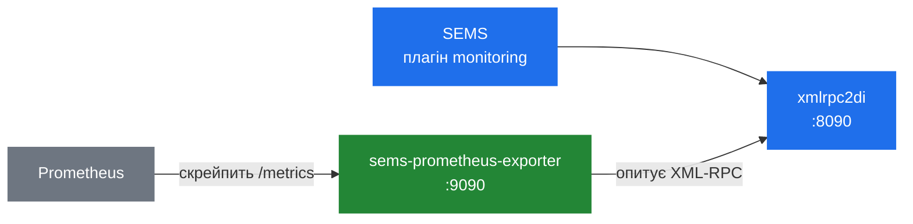

# 8.2 Моніторинг і статистика

> [!NOTE]
> Моніторинг у SEMS — це не система метрик. Це **лог на кожен дзвінок**, у який пишуть застосунки
> й з якого читають оператори по RPC. Усе інше — лічильники, агрегати, Prometheus — будується
> зверху й переважно поза процесом.

## Застосунок `monitoring`

`apps/monitoring` — звичайний плагін, що відкриває DI-інтерфейс ([8.1](28-rpc-architecture.md)).
Увесь його API видно в заголовку:

```cpp
class Monitor
{
  LogBucket logs[NUM_LOG_BUCKETS];
  LogBucket& getLogBucket(const string& call_id);
  ...
  void log(const AmArg& args, AmArg& ret);
  void logAdd(const AmArg& args, AmArg& ret);
  void inc(const AmArg& args, AmArg& ret);
  void dec(const AmArg& args, AmArg& ret);
  void addCount(const AmArg& args, AmArg& ret);
  void addSample(const AmArg& args, AmArg& ret);

  void markFinished(const AmArg& args, AmArg& ret);
  void setExpiration(const AmArg& args, AmArg& ret);
  void clear(const AmArg& args, AmArg& ret);
  void clearFinished(const AmArg& args, AmArg& ret);
  void erase(const AmArg& args, AmArg& ret);

  void get(const AmArg& args, AmArg& ret);
  void getSingle(const AmArg& args, AmArg& ret);
};
```

Три групи: **запис** (`log`, `logAdd`, `inc`, `dec`, `addCount`, `addSample`), **життєвий цикл**
(`markFinished`, `setExpiration`, `clear`, `clearFinished`, `erase`) і **читання** (`get`,
`getSingle`).

Сховище — шардований хеш із ключем за Call-ID, той самий патерн, що й у диспатчера подій
([2.2](03-event-system.md)) і таблиці транзакцій ([3.4](10-transaction-layer.md)):

```cpp
struct LogInfo {
  AmArg info;
  ...
};

struct LogBucket {
  std::map<string, LogInfo> log;
};

LogBucket logs[NUM_LOG_BUCKETS];
LogBucket& getLogBucket(const string& call_id);
```

Кожен дзвінок отримує `AmArg` — довільну структуру, яку заповнює застосунок. Схеми немає.
Застосунок логує те, що вважає цікавим, а клієнт це вичитує.

## Життєвий цикл і навіщо тут збирач сміття

```cpp
class MonitorGarbageCollector;

void markFinished(const AmArg& args, AmArg& ret);
void setExpiration(const AmArg& args, AmArg& ret);
void clearFinished();
```

Запис завершеного дзвінка не зникає — це знищило б сенс, бо дивитись на дзвінок зазвичай хочеться
*після* його завершення. Він позначається завершеним і спливає пізніше.

Звідси окремий потік-збирач сміття, і звідси те, за чим варто стежити:

> [!WARNING]
> Лог моніторингу необмежений так само, як будь-який кеш. Якщо ніщо не позначає дзвінки
> завершеними або строки життя довгі, а обсяг дзвінків високий, лог росте у звичайній купі
> ([2.3](04-memory-and-ownership.md)), доки процесу не стане зле. `setExpiration` і
> `clearFinished` не є необов'язковим прибиранням на завантаженому сервері.

`truncate_samples()` робить еквівалент для серій семплів:

```cpp
  void truncate_samples(list<SampleInfo::time_cnt>& v, struct timeval now);
```

`addSample()` записує значення з міткою часу; обрізання викидає ті, що поза вікном. Тобто типи
семплів є **ковзним вікном**, а не сумою за весь час: це швидкість, а не лічильник.

## `AmStats.h`

Власна статистика ядра — це два невеликі класи, і вони приємно прості:

```cpp
class MeanValue
{
 protected:
  double cum_val;
  size_t n_val;
 public:
  void push(double val){
    cum_val += val;
    n_val++;
  }
  double mean(){
    if(!n_val) return 0.0;
    return cum_val / float(n_val);
  }
};

class StddevValue
{
 protected:
  double cum_val;
  double sq_cum_val;
  size_t n_val;
  ...
};
```

Поточне середнє і поточне стандартне відхилення через суму квадратів. Стала пам'ять, сталий час,
без історії.

Це правильна форма для медіа-площини — не можна тримати список семплів на потік за п'ятдесяти
пакетів на секунду — але зверніть увагу, чого воно не вміє. **Немає перцентилів.** Середній
джитер у 20 мс каже дуже мало; вас насправді цікавить p95, а жоден із цих класів його не дасть.
Усе перцентильне доводиться рахувати зовні — із серій `addSample()` або з RTCP.

> [!NOTE]
> `mean()` ділить на `float(n_val)`, накопичуючи в `double`. Для тих кількостей семплів, які ці
> класи бачать, це неістотно, але це саме та деталь, яку варто знати, перш ніж будувати поверх
> неї білінговий розрахунок.

## `AmCallWatcher`

Окремий механізм відстеження стану дзвінків, і він подієвий, а не опитувальний:

```cpp
class CallStatusUpdateEvent : public AmEvent { ... };

class CallStatus
{
  virtual void update(CallStatusUpdateEvent* e) = 0;
  virtual CallStatus* copy() = 0;
  virtual void dump() { }
};

class AmCallWatcher
{
  void run();
  void on_stop();
  void process(AmEvent*);
  void dump();
};

class AmCallWatcherGarbageCollector { ... };
```

`AmCallWatcher` є `AmThread` і `AmEventHandler` ([2.2](03-event-system.md)). Сесії кладуть
`CallStatusUpdateEvent`; спостерігач застосовує їх до власних об'єктів `CallStatus` на власному
потоці.

Два проєктні моменти варті витягу.

**Оновлення асинхронні.** Сесія, що кладе оновлення статусу, не блокується й не бере лока на
даних спостерігача. Відстеження стану ніколи не сповільнює обробку дзвінків — а це важить, бо
альтернатива (глобальна таблиця дзвінків із м'ютексом) є рівно тим вузьким місцем, якого цей
дизайн уникає.

**`copy()` існує, щоб читачі ніколи не бачили розірваного стану.** Запит отримує знімок, а не
вказівник у структуру, яку інший потік саме змінює.

І знову збирач сміття, з тієї ж причини, що й у моніторингу: завершені дзвінки затримуються, щоб
їх можна було оглянути, а потім мусять бути прибрані.

## Prometheus сьогодні

Внутрішньопроцесного експортера метрик немає. Постачається **сайдкар**, на Rust:

```
apps/monitoring/tools/
  sems-prometheus-exporter/
  sems-get-callproperties/
  sems-list-active-calls/
  sems-list-calls/
  sems-list-finished-calls/
  sems-monitoring-lib/
  sems_*.py
```

`sems-prometheus-exporter` опитує ендпоінт XML-RPC і віддає `/metrics`:

```rust
const DEFAULT_LISTEN: &str = "0.0.0.0:9090";

fn main() {
    let (sems_url, rest) = sems_monitoring_lib::parse_url_arg(&args);
    let listen_addr = parse_listen_addr(&rest);
    ...
}
```

Тож справжня схема розгортання така:



Компроміси тут чесні. **За:** жодних змін у SEMS, жодної бібліотеки метрик, злінкованої в процес,
де падіння є аварією ([2.1](02-thread-model.md)), і експортер можна оновлювати окремо. **Проти:**
інтервал опитування між реальністю й вашим дашбордом, другий процес, який треба розгортати й
моніторити, і набір метрик, обмежений тим, що випадково відкриває `monitoring`.

Решта інструментів — `sems-list-active-calls`, `sems-list-finished-calls`,
`sems-get-callproperties` — це та сама бібліотека у вигляді CLI, і це найшвидший спосіб побачити,
чим зайнятий живий сервер. Поруч лежать еквіваленти на Python.

> [!NOTE]
> `yeti-switch/sems` пішов іншим шляхом і постачає нативний модуль `prometheus`
> ([12.3](45-fork-yeti-switch.md)). Це розходження добре ілюструє питання, що стоїть у
> [13.1](47-gaps-overview.md): чи місце можливості всередині процесу, чи поруч із ним?

## За чим варто стежити

З того, що ця книга розібрала, числа, які справді передвіщають проблеми:

| Сигнал | Звідки | Чому |
|---|---|---|
| Активні сесії | `monitoring`, `AmCallWatcher` | Проти `session_limit` ([2.5](06-sizing-and-tuning.md)) |
| Дзвінків за секунду | `check_and_add_cps()` | Проти `cps_limit` |
| Кількість потоків | `ps -L` | Один потік на дзвінок у типовій збірці ([2.1](02-thread-model.md)) |
| Непопадання в медіа-тик | сьогодні не експортується | Найраніша ознака проблем із медіа ([5.1](16-media-processor.md)) |
| Зайняті RTP-порти | сьогодні не експортується | Проти налаштованого діапазону |
| Транзакції за станами | `dumps_transactions()` | Зростання в `TS_COMPLETED` означає піра, що перестав відповідати ([3.4](10-transaction-layer.md)) |
| Сесії в черзі на прибирання | сьогодні не експортується | Черга з `sleep(5)` ([2.3](04-memory-and-ownership.md)) |

Чотири з цих семи сьогодні не експортує ніщо. Ця прогалина і те, як її закрити, — у
[13.3](49-metrics-and-observability.md).
