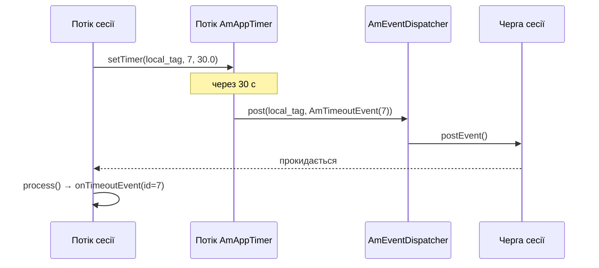
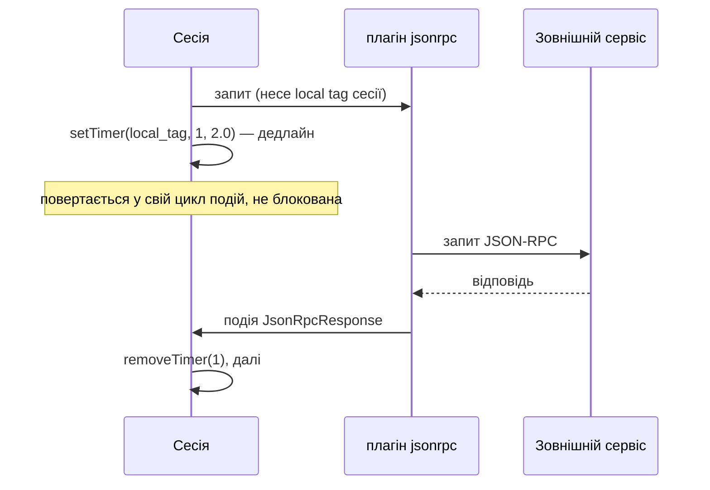

# 8.3 Таймери і події застосунку

> [!NOTE]
> Цей розділ замикає коло, відкрите в [2.2](03-event-system.md). Усе асинхронне в SEMS —
> спрацювання таймера, приїзд RPC-відповіді, штурхання одного модуля іншим — закінчується
> однаково: подія падає в чергу сесії й обробляється на власному потоці цієї сесії.

## Два види таймерів

Таймери в цій книзі вже були — колесо, що крутить RFC 3261 ([3.4](10-transaction-layer.md)), і
медіа-тик 10 мс ([5.1](16-media-processor.md)). `AmAppTimer` — третій, і саме ним користуються
застосунки.

```cpp
class DirectAppTimer
{
  virtual ~DirectAppTimer() {}
  virtual void fire()=0;
};

class _AmAppTimer
{
  app_timer* create_timer(const string& q_id, int id, unsigned int expires);
  ...
public:
  void setTimer(const string& eventqueue_name, int timer_id, double timeout);
  void removeTimer(const string& eventqueue_name, int timer_id);
  void removeTimers(const string& eventqueue_name);

  void setTimer(DirectAppTimer* t, double timeout);
  void removeTimer(DirectAppTimer* t);
  void setTimer_unsafe(DirectAppTimer* t, double timeout);
  void removeTimer_unsafe(DirectAppTimer* t);
};
```

Два API, і різниця важлива.

**Таймери в чергу** — `setTimer(eventqueue_name, timer_id, timeout)`. Таймер адресується **іменем
черги подій**, яким є local tag сесії ([3.5](11-dialog-layer.md)). При спрацюванні в цю чергу
кладеться `AmTimeoutEvent`, і він обробляється на власному потоці сесії. Саме це обгортає
`AmSession::setTimer()` ([4.1](12-amsession.md)), і саме це вам майже завжди потрібно.

**Прямі таймери** — `setTimer(DirectAppTimer*, timeout)`. `fire()` викликається **на потоці
таймерів**. Ні черги, ні сесії, ні передачі.

> [!WARNING]
> `DirectAppTimer::fire()` виконується на потоці таймерів. Заблокуватись там означає затримати
> кожен інший таймер у процесі — включно, опосередковано, з таймерами застосунків, яких чекають
> інші дзвінки. Вживайте це для інфраструктури, якій нема куди класти події, тримайтесь у кількох
> мікросекундах і ніколи не робіть там вводу-виводу.

Варіанти з `_unsafe` пропускають внутрішнє блокування для тих, хто вже тримає лок. Як і натякає
назва, вони не для коду застосунків.

Адресація таймера **іменем, а не вказівником** — важливе проєктне рішення. Сесія може завершитись
із невиконаним таймером; таймер тоді резолвить ім'я, якого вже немає, публікація не вдається, і
ніщо не розіменовує звільнений об'єкт ([2.2](03-event-system.md)). Таймери на вказівниках
вимагали б, щоб сесія надійно скасовувала кожен таймер перед смертю — а це рівно той тип
інваріанта, що ламається на шляху помилки.

## Шлях таймера



Сесія ніколи не блокується. Вона просить таймер і повертається у свій цикл подій; через тридцять
секунд приїжджає подія, як і будь-яка інша. Ні сну, ні опитування, ні окремого потоку на таймер.

`AmTimeoutEvent` — це `AmPluginEvent` з іменем `timer_timeout`, що несе ідентифікатор таймера
([2.2](03-event-system.md)), і саме тому ідентифікатор є `int`, який обираєте ви: так ви
розрізняєте власні таймери в одному обробнику.

```cpp
  static bool timersSupported();
```

Перевірка існує тому, що `AmAppTimer` живе в плагіні — немає плагіна, немає таймерів
([7.1](24-plugin-architecture.md)). Виклик `setTimer()` без нього тихо не спрацьовує, тож модуль,
що залежить від таймерів, має перевірити це на завантаженні й відмовитись стартувати, а не
поводитись дивно під час дзвінка.

## `AmPeriodicThread`

Для роботи, що є періодичною, а не одноразовою, і не належить жодній сесії:

```cpp
class AmPeriodicThread { ... };
```

Потік, що прокидається з інтервалом і щось робить — спливання кешу, оновлення апстріму, проба
здоров'я. Модулі використовують його для власного прибирання; він не адресується за іменем і не
кладе нічого, доки ви цього не зробите.

У DSM є еквівалент на рівні скрипта: `SystemDSM` виконує діаграму без прикріпленого дзвінка,
керовану подіями `Startup`, `Reload` і `System` ([7.2](25-dsm.md)). Періодична фонова робота
скриптом, а не C++, із тією локалізацією, яку це дає ([7.4](27-app-tradeoffs.md)).

## Як покласти подію в сесію ззовні

Єдиний API, вартий запам'ятовування, бо саме так усе зовнішнє дотягується до дзвінка:

```cpp
  bool postEvent(const string& local_tag, AmEvent* event);
```

на `AmSessionContainer`, із делегуванням у диспатчер
([4.2](13-session-container-and-factories.md)).

Три властивості, і всі випливають із [2.2](03-event-system.md):

- **Він повертає `bool`.** `false` означає, що сесії вже немає. Ігнорувати це значення — і є те,
  як модулі тихо гублять події.
- **Володіння передається.** Черга видаляє подію після `process()`. Не тримайте вказівник, не
  публікуйте двічі, і видаліть її самі, якщо публікація не вдалась.
- **Ви не знаєте, коли вона виконається.** Лише те, що це буде на потоці сесії, по порядку, після
  того, що вже в черзі.

`AmPluginEvent` є універсальним носієм — ім'я і `AmArg` ([2.2](03-event-system.md)) — тож модуль
може надіслати сесії структуровані дані, і жоден із них не мусить знати заголовки іншого.

## Асинхронний RPC-цикл

Поєднання цього розділу з [8.1](28-rpc-architecture.md) дає патерн, найважливіший на практиці:
**покликати зовнішній сервіс, не блокуючи дзвінок.**



Сесія видає запит, зводить таймер як свій дедлайн і повертається до обробки подій. Або приїде
відповідь подією, або раніше спрацює таймер. В обох випадках потік сесії весь час вільний.

Порівняйте це з синхронним HTTP-викликом із Python-скрипта або дією `mod_curl` у DSM
([7.2](25-dsm.md), [7.3](26-ivr-and-python.md)), яка тримає потік сесії — а в Python ще й GIL —
увесь цей час.

> [!TIP]
> **Завжди зводьте таймер поруч із асинхронним запитом.** Сервіс, який не відповість ніколи,
> інакше лишає сесію чекати на подію, що не приїде, і вона житиме до `dead_rtp_time` через п'ять
> хвилин ([5.2](17-rtp-stream.md)). Таймер і є таймаутом; більше його ніщо не забезпечує.

DSM відкриває обидва боки цього напряму — `JsonRpcRequest`, `JsonRpcResponse` і `XmlrpcResponse`
є типами подій, на які скрипт може реагувати ([7.2](25-dsm.md)) — тож увесь патерн доступний у
перезавантажуваному скрипті взагалі без C++.
