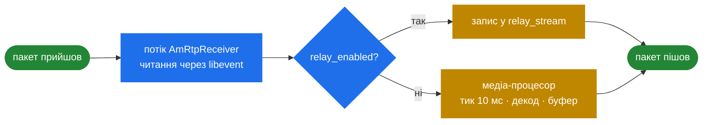

# 9.4 RTP mux і релей

> [!IMPORTANT]
> Релей — це не функція, прикручена до медіа-шляху, а **скорочення повз нього**. Релейований
> пакет читає й пише потік RTP-приймача, і він ніколи не доходить ні до медіа-процесора, ні до
> аудіо-ланцюжка, ні до джитер-буфера ([5.2](17-rtp-stream.md)). Саме тому SBC тягне десять тисяч
> дзвінків на залізі, яке ледве впоралось би з тисячею конференц-каналів.

## Шлях релею

```cpp
  /** pointer to relay stream.
      ... or by the AmRtpReceiver thread while relaying!  */
  AmRtpStream*    relay_stream;
```

Цей коментар і є всією історією. За `relay_enabled` подорож пакета така:



Порівняння двох гілок:

| | Релей | Повне медіа |
|---|---|---|
| Задіяно потоків | Один | Приймач + медіа-процесор |
| На пакет | Прочитати, можливо переписати заголовок, записати | Декод, ресемплінг, буфер, мікс, ресемплінг, кодування |
| Додана затримка | Менше мілісекунди | Щонайменше один тик 10 мс плюс глибина playout |
| Джитер-буфер | Немає — джитер проходить наскрізь | Поглинається ([5.5](20-dtmf-and-jitter.md)) |
| Видимість DTMF | Лише RFC 2833, і лише якщо не відфільтровано | Усі три джерела |
| CPU | Приблизно memcpy | Домінує кодек |

Менша затримка релею — справжня перевага, а не лише економія: пропустити пакети крізь себе додає
значно менше затримки, ніж термінувати й породжувати потік заново.

Ціна в тому, що **з аудіо не можна зробити нічого**. Ні анонсу, ні запису через аудіо-ланцюжок,
ні inband-DTMF, ні транскодингу. Щойно застосунку знадобиться щось із цього, `requiresProcessing()`
перемикається, і вживається повний шлях ([6.2](22-b2b-media.md)).

## Чим релей усе ж керує

Релей не є сліпим пересиланням. Прапорці з [5.2](17-rtp-stream.md) діють усі:

```cpp
  bool relay_raw;
  bool relay_transparent_seqno;
  bool relay_transparent_ssrc;
  bool relay_filter_dtmf;
  PayloadMask relay_payloads;
```

- **`relay_payloads`** — 128-бітна маска, що на кожен тип payload вирішує, чи перетне пакет межу.
  Тож SBC може релеїти аудіо, викидаючи відео, або блокувати кодек, який відмовляється нести, не
  декодуючи нічого ([6.1](21-b2b-session.md)).
- **`relay_filter_dtmf`** — зрізати RFC 2833 із релейованого потоку, зазвичай тому, що DTMF
  обробляє сам SBC.
- **Прапорці прозорості** — зберегти чи переписати порядкові номери й SSRC. Збереження робить
  релей невидимим, чого деякі ендпоінти потребують; переписування робить ноги незалежними, чого
  хочеться, якщо будь-яка нога може перевстановлюватись окремо.
- **`relay_raw`** — переслати датаграму байт у байт, разом із заголовками.

## Мультиплексування RTP

`AmRtpMuxStream` — окремий механізм, що розв'язує іншу проблему: **забагато пакетів**.

```cpp
#define MAX_RTP_PACKET_LEN 512 // way too long - restricted by max mux frame length

typedef struct { ... } rtp_mux_hdr_t;
typedef struct { ... } rtp_mux_hdr_setup_t;
typedef struct { ... } rtp_mux_hdr_compressed_t;

struct MuxStreamState {
  unsigned int last_mux_packet_id;
  unsigned int ts_increment;
  unsigned int rtp_hdr_len;
  unsigned int setup_frame_ctr;
  unsigned int last_setup_frame_ts;
  ...
};

class AmRtpMuxStream
{
  void recvPacket(int fd, unsigned char* pkt, size_t len);
  ...
};

struct MuxStreamQueue
{
  int l_sd;
  struct sockaddr_storage r_saddr;
  struct sockaddr_storage l_saddr;
  unsigned int mux_packet_id;
  int sendQueue(bool force = false);
  int init(const string& _remote_ip, unsigned short _remote_port);
  void close();
};
```

Проблема, яку це розв'язує: тисяча дзвінків по 50 пакетів на секунду на напрямок — це 100 000
датаграм за секунду, у кожній ~172 байти, з яких 12 — RTP-заголовок, а 42 — накладні IP+UDP.
**Накладні перевищують корисне навантаження**, і саме кількість системних викликів стає вузьким
місцем.

Мультиплексування пакує багато малих RTP-пакетів із багатьох потоків в одну більшу датаграму між
двома SEMS-обізнаними ендпоінтами. Три типи заголовків показують, наскільки далеко це заходить:

- **`rtp_mux_hdr_t`** — звичайне обрамлення.
- **`rtp_mux_hdr_setup_t`** — шлеться періодично (`setup_frame_ctr`, `last_setup_frame_ts`), щоб
  встановити параметри потоків.
- **`rtp_mux_hdr_compressed_t`** — усталений режим, де RTP-заголовок значною мірою випущено, бо
  приймач уже знає його з setup-кадру.

`ts_increment` і `rtp_hdr_len` у `MuxStreamState` — це те, що робить таку реконструкцію можливою:
якщо мітки зростають на відому сталу, а розкладка заголовка фіксована, більша частина заголовка
передбачувана й слати її не треба.

`MuxStreamQueue::sendQueue(bool force)` — це рішення про батчинг: накопичувати, доки кадр не
заповниться, або скинути на `force`, коли затримка важливіша за ефективність.

> [!WARNING]
> Мультиплексування **не є стандартним RTP**. Обидва кінці мусять говорити цим конкретним
> обрамленням, тож воно працює між інстансами SEMS (або чимось, що реалізує той самий формат) — і
> ніде більше. Це приватна оптимізація для внутрішньої ноги, а не те, що показують оператору.

`AmRtpReceiver::startRtpMuxReceiver()` стартує окремо в `main()` ([2.4](05-lifecycle.md)), після
звичайного RTP-приймача: mux-трафік приїжджає на власний сокет і потребує власного читача.

## Як обирати

**Релей** — щоразу, коли застосунку не потрібне аудіо. Це типовий режим у `sbc`
([6.4](23b-sbc-profiles.md)) і причина, чому ємність SBC міряють десятками тисяч.

**Повне медіа** — коли щось мусить породжувати, споживати або мікшувати аудіо: анонси, запис,
конференції ([9.2](32-conference-and-mixing.md)), транскодинг.

**Mux** — лише між ендпоінтами, якими ви керуєте, і коли обмеженням є саме кількість пакетів, а не
смуга чи CPU. Це вузька оптимізація й перше, що варто вимкнути, коли дебажите щось медійне на цій
нозі.
