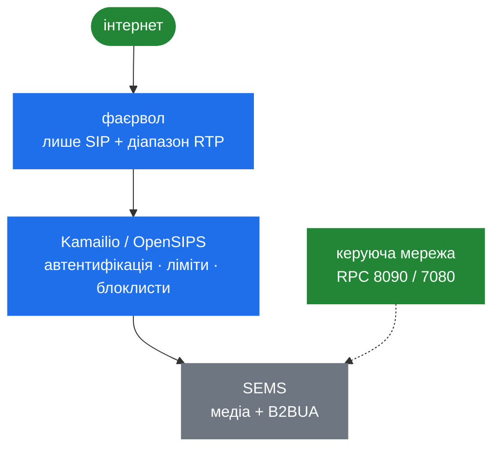

# 10.1 Поверхня атаки

> [!IMPORTANT]
> SEMS — це **один процес без розділення привілеїв** ([2.1](02-thread-model.md)). Немає пісочниці
> між SIP-парсером і вашим модулем call control, немає воркера, якого можна втратити й
> перезапустити. Усе, що досяжне з мережі, досяжне для всього іншого в процесі. Це рамка для всієї
> цієї частини.

## Що слухає

| Поверхня | Типово | Досяжна для | Автентифікація |
|---|---|---|---|
| SIP | 5060, і 5080 у зразковому конфізі | Кожного, кого до неї змаршрутизували | Лише якщо налаштуєте |
| RTP | `rtp_low_port`–`rtp_high_port`, у зразку 10000–60000 | Кожного, хто вгадає порт | **Немає** |
| XML-RPC | 8090 | Кожного, кого змаршрутизували | **Немає** ([8.1](28-rpc-architecture.md)) |
| JSON-RPC | 7080 | Кожного, кого змаршрутизували | **Немає** |
| `monitoring` | UDP, за `doc/README.stats` | Кожного, кого змаршрутизували | **Немає** |

Три з цих п'яти не мають автентифікації взагалі й не мають механізму її додати. Їхній єдиний
захист — мережева досяжність. Це твердження варто перечитати двічі перед розгортанням.

## Найбільша експозиція — RPC-порти

Вони заслуговують окремого розділу, бо наслідки гірші, ніж очікують. Неавтентифікований клієнт,
що дотягнувся до 8090 чи 7080, може викликати **будь-який зареєстрований DI-метод**
([8.1](28-rpc-architecture.md)):

- прочитати стан і метадані кожного дзвінка в процесі
  ([8.2](29-monitoring-and-stats.md)),
- здійснити дзвінок через `di_dial`, який обгортає `AmUAC::dialout()`
  ([4.2](13-session-container-and-factories.md)) — це шахрайство з трафіком без жодних облікових
  даних,
- додати чи прибрати SIP-реєстрацію через `registrar_client`
  ([9.1](31-registrar-client.md)) — викрадення номера або зняття транку,
- змінити поведінку SBC, бо зразкова конфігурація експортує `sbc` напряму:

```
direct_export=sbc
```

> [!WARNING]
> Ні пароля, ні токена, ні TLS, ні контролю доступу на рівні методів. Біндьте це на loopback або
> на виділений керуючий інтерфейс, закривайте фаєрволом і вважайте досяжність до них рівноцінною
> доступу до shell. Якщо віддалена система мусить кликати — поставте перед нею reverse proxy, що
> робить автентифікацію.

## Селектор застосунку контролює атакувальник

Це легко проґавити, бо воно виглядає конфігурацією, а не входом
([4.2](13-session-container-and-factories.md)):

```
# application = $(apphdr)
```

З `$(apphdr)` **викликач обирає, який застосунок запуститься**, виставивши `P-App-Name`. З
`$(ruri.user)` чи `$(ruri.param)` він обирає це через request URI.

Не контролюються викликачем лише `App_SPECIFIED` — літеральне ім'я застосунку — і `$(mapping)`,
де шаблон ваш.

На інтерфейсі, досяжному лише з вашого проксі, це нормально і є задуманою інтеграцією
([11.1](40-with-kamailio.md)). На будь-якому іншому це віддалений вибір шляху виконання коду.

## Підстановка заголовків у профілях SBC

Та сама форма, рівнем нижче ([6.4](23b-sbc-profiles.md)). `ParamReplacer` може прочитати із
запиту будь-що:

```
RURI=sip:$rU@$H(P-Destination)
```

Профіль, що маршрутизує за `$H(...)`, дозволяє викликачу обрати собі напрямок. `$si` — справжня
адреса джерела — принаймні чесний; заголовок є тим, що пір набрав.

Модуль call control `ctl` ([6.5](23c-sbc-call-control.md)) існує саме для того, щоб заголовки
керували політикою: це функція між довіреними системами і вразливість в усіх інших випадках.

## Плагіни завантажуються з диска

`AmPlugIn` робить `dlopen` усього в теці плагінів ([7.1](24-plugin-architecture.md)). Кожен, хто
може записати туди `.so`, виконає код у процесі SEMS при наступному рестарті. Тож тека плагінів,
тека конфігурації і `plugin_config_path` — усе це частина межі довіри, і права на них важать не
менше за будь-які облікові дані.

## Де лежать облікові дані

| Що | Де | Форма |
|---|---|---|
| Паролі реєстрацій | Конфіг `reg_agent` або база | `SIPRegistrationInfo::pwd`, звичайний рядок ([9.1](31-registrar-client.md)) |
| Облікові дані `uac_auth` | Конфігурація або через DI | Відкрито ([4.4](15-session-event-handlers.md)) |
| Кеш і ентропія ZRTP | `cache_path`, `entropy_path` | Файли, постійні ([9.6](36-zrtp-and-srtp.md)) |
| Доступи до бази | Конфігурація модуля | Відкрито |

Нічого не шифрується на диску, і цього не передбачено. Права на файли — увесь контроль
([10.3](39-security-hardening.md)).

## Що може спробувати неавтентифікований атакувальник

За умови лише досяжності SIP-порту:

**Вичерпати сесії.** Кожен INVITE, що пройшов допуск, створює сесію, а в типовій збірці це потік
ОС ([2.1](02-thread-model.md)). Саме тому `session_limit` і `cps_limit` є першим кроком
hardening, а не оптимізацією ([2.5](06-sizing-and-tuning.md)).

**Займати ресурси по 32 секунди.** Дзвінок у бік напрямку, що не відповідає, тримає транзакцію до
таймера B ([3.4](10-transaction-layer.md)), а з нею сесію й потік.

**Тримати сесії п'ять хвилин.** Дзвінок, встановлений і покинутий без `BYE`, живе до
`dead_rtp_time`, типово 300 секунд ([5.2](17-rtp-stream.md)).

**Дотягнутись до парсера.** `sip_parser` — це C поверх сирих вказівників, досяжний однією
неавтентифікованою датаграмою, і все нижче за течією довіряє його результату
([3.3](09-parser.md)). Це найцінніша мішень у дереві.

**Десинхронізувати TCP-потік.** Фреймінг залежить від `Content-Length` ([3.3](09-parser.md)); пір,
який про нього збрехав, вибиває потік із такту.

**Перенаправити аудіо.** Симетричний RTP у режимі `passive` вчить віддалену адресу з того, що
приїхало ([5.2](17-rtp-stream.md)) — сімейство RTP bleed, і [10.2](38-security-media.md).

## Чого в картині немає

Проговорімо відсутнє явно, бо припущення, що воно є, і є тим, як люди страждають:

- **Немає SRTP чи DTLS-SRTP.** Зашифроване медіа можна релеїти, але не термінувати
  ([9.6](36-zrtp-and-srtp.md)).
- **Немає автентифікації RPC** і немає гачка, щоб її додати.
- **Немає обмеження швидкості на джерело.** `cps_limit` глобальний, а не на піра. Обмеження на
  джерело — справа проксі ([11.1](40-with-kamailio.md)).
- **Немає списку дозволених IP для SIP.** Це робота фаєрвола.
- **Немає журналу аудиту.** `SBCEventLog` і `monitoring` пишуть дзвінки, а не адміністративні дії
  ([8.2](29-monitoring-and-stats.md)).
- **Немає розділення привілеїв.** Один процес, один радіус ураження.

## Форма захищеного розгортання



Патерн, що випливає з усього вище: **не ставте SEMS в інтернет.** Поставте перед ним проксі.
Проксі автентифікує, обмежує швидкість, блоклистить і маршрутизує — усе те, що він робить дешево,
а SEMS не робить узагалі ([1.1](01-introduction.md)) — і віддає SEMS лише вже перевірені дзвінки.

Це не обхід слабкості. Це та архітектура, яку проєкт описує для себе сам: SEMS призначений
*доповнювати* проксі, і розподіл безпекових обов'язків є частиною того, що це означає.
