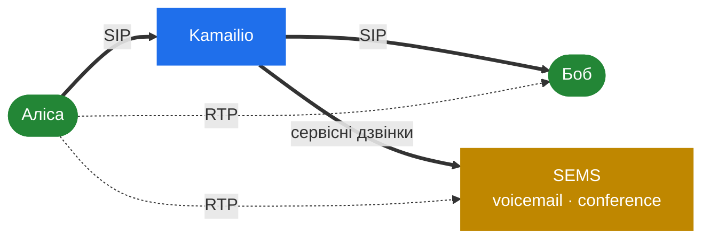
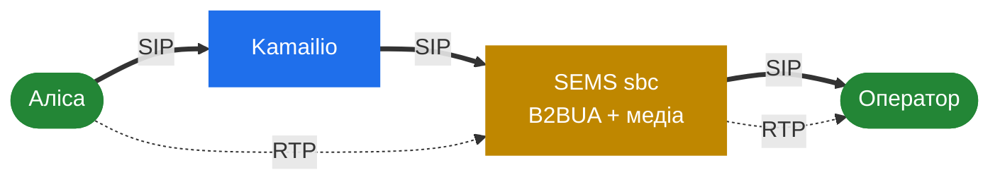

# 11.1 SEMS разом з Kamailio

> [!NOTE]
> Це парний розділ до [Kamailio Handbook](https://denyspozniak.github.io/kamailio-handbook/).
> [1.1](01-introduction.md) відповів, *який* інструмент брати; цей відповідає, *як їх зшивають,
> коли відповідь — обидва*, а в будь-якій мережі скільки-небудь цікавого розміру вона саме така.

## Розподіл обов'язків

| | Kamailio | SEMS |
|---|---|---|
| Володіє | Реєстрацією, маршрутизацією, автентифікацією, шляхом високого CPS | Дзвінками, яким потрібне аудіо |
| Бачить | Кожен запит, дешево | Лише те, що передав проксі |
| Коштує | Частки мілісекунди на повідомлення | Сесію, потік, пару портів |
| Ламається як | Один воркер | Увесь процес ([2.1](02-thread-model.md)) |

Проксі — це вхідні двері й фільтр. Він автентифікує, обмежує швидкість, блоклистить і
маршрутизує — нічого з цього SEMS не робить — і передає далі лише невелику частку дзвінків,
яким потрібен медіа-сервер ([10.1](37-security-surface.md)).

## Передача

Файл `doc/Howtostart_simpleproxy.txt` у дереві показує це напряму, і читати його варто як
канонічний патерн, а не як приклад:

```text
route[SERVICES] {
     if ($rU=~"^200.*") {
             remove_hf("P-App-Name");
             append_hf("P-App-Name: echo\r\n");
             $ru = "sip:" + $rU + "@" + "127.0.0.1:5070";
             route(RELAY);
             exit;
     }
     if ($rU=~"^300.*") {
             remove_hf("P-App-Name");
             append_hf("P-App-Name: conference\r\n");
             $ru = "sip:" + $rU + "@" + "127.0.0.1:5070";
             route(RELAY);
             exit;
     }
}
```

У цих п'яти рядках відбувається три речі:

1. **Проксі вирішує, який застосунок запуститься**, і каже це в `P-App-Name`.
2. **Request URI переписується** на інстанс SEMS.
3. **`remove_hf` перед `append_hf`** — вхідний заголовок викидається до того, як додається наш.

Третій пункт — критичний для безпеки. Без видалення викликач, що сам виставив `P-App-Name`,
обирає застосунок ([4.2](13-session-container-and-factories.md)). Приклад робить це правильно, і
будь-яка похідна від нього конфігурація мусить зберегти цей порядок.

На боці SEMS — один рядок:

```
application=$(apphdr)
```

Існують інші селектори — `$(ruri.user)`, `$(ruri.param)`, `$(mapping)` — і обмін той самий: чим
більше проксі каже явно, тим менше SEMS доводиться домислювати.

> [!WARNING]
> `P-App-Name` є довіреним входом із недовіреного джерела, якщо SIP-порт SEMS не досяжний
> **лише** з ваших проксі. Прив'яжіть його до внутрішньої адреси й закрийте фаєрволом
> ([10.3](39-security-hardening.md)). Двокомпонентний дизайн припускає довірений зв'язок між
> компонентами.

## Приховування топології: `topoh`, `topos` і просто термінування

Три механізми для однієї проблеми — не дати дальньому боку вивчити вашу внутрішню адресацію — за
три дуже різні ціни. Саме заради цього порівняння [1.1](01-introduction.md) відсилає вас сюди.

### `topoh` у Kamailio

Кодує заголовки, що ідентифікують діалог, просто на місці. `Via`, `Record-Route`, `Contact` і
решта маскуються оборотним кодуванням; проксі декодує їх назад на зворотному шляху.

- **Stateless.** Усе, потрібне для оберту, лежить у самому повідомленні.
- **Дешево.** Шлях пересилання проксі не змінюється.
- **Нічого не зберігається**, тож нічого не втрачається при рестарті й нічого не треба реплікувати.
- Повідомлення ростуть, а закодовані значення помітно дивні для того, хто дивиться.

### `topos` у Kamailio

Іде далі: знімає заголовки зовсім і тримає оригінали в базі або хеш-таблиці, лишаючи натомість
короткі непрозорі ключі.

- **Stateful.** Потрібне сховище, і воно мусить жити стільки, скільки діалог.
- **Чистіше на дроті** — дальній бік бачить майже нічого.
- **Рестарт і кластеризація стають питаннями**: втратили сховище — втратили здатність
  маршрутизувати внутрішньодіалогові запити.

### SEMS: термінувати

B2BUA не приховує топологію — він її ніколи не відкриває. B-нога є **новим діалогом** із власним
Call-ID, власними тегами, власним простором CSeq і власним route set
([6.1](21-b2b-session.md)). Там просто немає нічого з A-ноги, чому б витікати.

- **Ні модуля, ні конфігурації, ні сховища.** Це властивість самого термінування.
- **Повне.** Не кодування, яке треба обертати, а справді окремі діалоги.
- **Дорого.** Ви заплатили повною сесією, потоком і, якщо медіа тече крізь вас, парою портів.

### Поруч

| | `topoh` | `topos` | B2BUA |
|---|---|---|---|
| Стан | Немає | База або хеш-таблиця | Сама сесія |
| Ціна на дзвінок | Мізерна | Мала, плюс сховище | Сесія і потік |
| Оборотне вами | Так | Так, через сховище | Ні — ноги незалежні |
| Переживає рестарт | Так | Лише якщо переживе сховище | Ні, дзвінок закінчується |
| Що ще дає | — | — | Контроль медіа, таймери й заголовки на ногу |
| Ламається, коли | Пір псує заголовки | Сховище недоступне | У вас скінчилась ємність |

> [!TIP]
> **Якщо вам потрібне лише приховування топології — робіть його в проксі.** `topoh` майже
> безкоштовний, `topos` дешевий; термінувати кожен дзвінок у B2BUA заради приховування заголовків
> означає платити за медіа-сервер, щоб він виконував роботу проксі.
>
> **Якщо ви й так збирались термінувати** — заради медіа, транскодингу, таймерів сесії на ногу,
> політики кодеків — то приховування дістається задарма, і `topoh` попереду вже надлишковий.

Поля `hiding` у профілі SBC ([6.4](23b-sbc-profiles.md)) є третьою, вужчою річчю: маскування
*URI й ідентичностей* усередині діалогу, який B2BUA вже й так відділив. Корисно, коли доводиться
релеїти Contact чи From, але не те, що в них написано.

Зверніть увагу й на `transparent_dlg_id` ([6.4](23b-sbc-profiles.md)), який копіює ідентифікатори
діалогу в B-ногу і тим самим **вимикає** приховування — для пірів, що корелюють ноги за Call-ID.
Свідомий обмін приватності на сумісність.

## Дві топології

### SEMS як сервер застосунків

Проксі маршрутизує більшість дзвінків між ендпоінтами й віддає в SEMS лише сервісні — голосову
пошту, конференції, анонси.



Звичайні дзвінки SEMS не чіпають, тож він рахується лише під сервісну частку. Це та форма, яку
описує `Howtostart_simpleproxy.txt`.

### SEMS як B2BUA у розриві

Кожен дзвінок іде через SEMS, який термінує й породжує заново.



Тепер SEMS рахується під увесь трафік, а приховування топології, контроль медіа й політика
кодеків ідуть у комплекті ([6.3](23-sbc.md)). Релей тримає ціну на дзвінок низькою
([9.4](34-rtp-mux-and-relay.md)) — але кожен дзвінок є сесією й потоком.

## Де функції проксі закривають прогалини SEMS

Читаючи два хендбуки разом, кілька відсутностей SEMS виявляються функціями Kamailio:

| Чого бракує SEMS | Що дає Kamailio | Посилання |
|---|---|---|
| Групи пірів із перевіркою здоров'я | `dispatcher` — набори, алгоритми, пробінг OPTIONS | [13.5](51-peer-dispatching.md) |
| Обмеження швидкості на джерело | `pike`, `htable` | [10.1](37-security-surface.md) |
| Вхідні блоклисти | `permissions`, динамічні блоклисти | [10.3](39-security-hardening.md) |
| Реєстратор і user location | `registrar`, `usrloc` | [9.1](31-registrar-client.md) |
| Дешеве приховування топології | `topoh`, `topos` | вище |
| Відправка SIP у Homer | `siptrace` із HEP | [13.2](48-hep-and-capture.md) |

Останній рядок — найгостріша ілюстрація поділу: Kamailio знімає розшифрований SIP усередині проксі
й шле його по HEP; SEMS пише pcap-файли локально і транспорту HEP не має взагалі.

Нічого з цього SEMS не мусить у себе відрощувати. Це обов'язки проксі, і саме двокомпонентний
дизайн робить розумним те, що SEMS їх не має.

## Чеклист для пари

- [ ] SIP-порт SEMS досяжний лише з проксі
- [ ] Проксі робить `remove_hf` перед `append_hf` для `P-App-Name`
- [ ] Обмеження швидкості й блоклисти в проксі, а не в SEMS
- [ ] Автентифікація в проксі, якщо SEMS не потрібна на кожну ногу
  ([6.4](23b-sbc-profiles.md))
- [ ] Приховування топології вирішене один раз, в одному місці
- [ ] `options_session_limit` виставлений так, щоб проксі бачив завантажений SEMS, а не мертвий
  ([2.5](06-sizing-and-tuning.md))
- [ ] Dispatcher або failover проксі керує інстансами SEMS
  ([11.2](41-topologies-and-ha.md))
