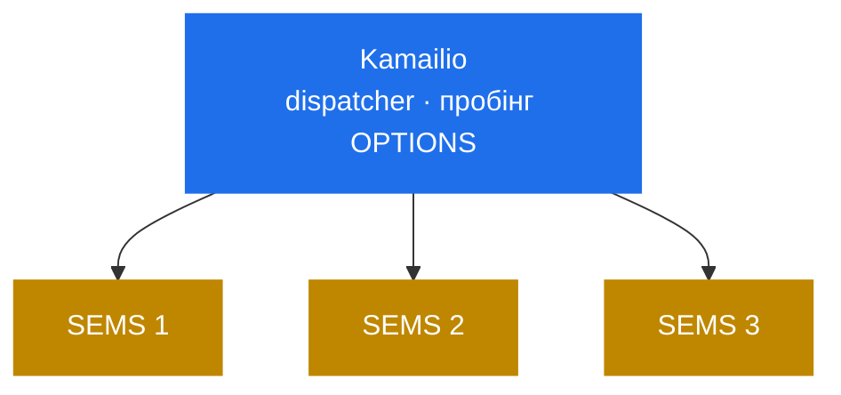

# 11.2 Топології і HA

> [!IMPORTANT]
> Два інстанси SEMS не ділять **нічого**. Ні спільної пам'яті, ні реплікованого стану, ні
> кластерного протоколу ([2.3](04-memory-and-ownership.md)). Кожен дизайн високої доступності тут
> випливає з цього одного факту, і вдавати інакше — це те, як будують кластери, які не роблять
> failover.

## Масштабування інстансами, а не воркерами

Kamailio масштабується форканням більшої кількості воркерів у той самий пул спільної пам'яті. У
SEMS такого пулу немає, тож одиницею масштабування є **процес**, а на практиці — машина або
контейнер.

Стелі, у порядку, у якому ви їх зазвичай зустрічаєте ([2.5](06-sizing-and-tuning.md)):

| Стеля | Задається |
|---|---|
| Потоки | Один на дзвінок типово ([2.1](02-thread-model.md)); `pids.max`, `threads-max` |
| Запас медіа-тика | `media_processor_threads`, типово **1** ([5.1](16-media-processor.md)) |
| RTP-порти | Налаштований діапазон |
| Файлові дескриптори | Сокети плюс файли плюс з'єднання модулів |
| CPU на транскодинг | Вибір кодека, різниця вчетверо ([5.4](19-codecs-and-plugins.md)) |

Дві з них є властивостями інстансу, і обійти їх усередині одного процесу не можна. Зокрема
**callgroup не може розтягнутись на кілька потоків** ([5.1](16-media-processor.md)), тож одна
велика конференція обмежена одним ядром незалежно від розміру інстансу
([9.2](32-conference-and-mixing.md)).

## Що тут означає «стан»

Ніщо не переживає інстанс, і варто чітко сказати, що саме втрачається:

| Стан | Де живе | При втраті інстансу |
|---|---|---|
| Сесії | Об'єкт сесії і її потік | Зникає |
| Діалоги | `AmSipDialog` у сесії | Зникає |
| Транзакції | `trans_table` ([3.4](10-transaction-layer.md)) | Зникає |
| Медіа-потоки | `AmRtpStream`, прив'язані порти | Зникає |
| Кімнати конференцій | `AmConferenceStatus` ([9.2](32-conference-and-mixing.md)) | Зникає |
| Кеш реєстрацій | `RegisterCache` ([6.5](23c-sbc-call-control.md)) | Зникає, відбудовується |
| Лог моніторингу | `monitoring` ([8.2](29-monitoring-and-stats.md)) | Зникає |
| Записи на диску | Файлова система | Переживає, можливо обрізаними |

> [!WARNING]
> **Збереження дзвінків немає.** Інстанс, що помер, кидає кожен дзвінок на ньому, і жоден інший
> інстанс їх не підхопить — стан діалогу, стан медіа й RTP-порти жили в тому процесі. Висока
> доступність у SEMS означає, що виживають *нові* дзвінки, а не наявні.

Для медіа-сервера це не дивно, але це інакше, ніж у проксі, де stateless-воркера можна замінити
посеред транзакції.

## Розподіл дзвінків

Це робить проксі попереду ([11.1](40-with-kamailio.md)). SEMS не має ні списку пірів, ні
пробінгу, ні способу передати дзвінок сусіду ([13.5](51-peer-dispatching.md)) — тож логіка
розподілу цілком живе в `dispatcher` Kamailio або його аналогу.

Дві налаштування на боці SEMS змушують це працювати як слід:

**`options_session_limit`, виставлений нижче за `session_limit`**
([2.5](06-sizing-and-tuning.md)). Повний інстанс продовжує відповідати на keepalive-`OPTIONS` і
може повідомити про себе як про завантаженого, а не замовкнути й бути позначеним мертвим — що
прибрало б його різко, обірвавши його дзвінки.

**`cps_limit` і `session_limit`, виставлені свідомо.** `503` — це дзвінок, який проксі
змаршрутизує кудись інде; прийнятий дзвінок на насиченому інстансі — це поганий звук для всіх, хто
вже на ньому.

## Що змушує до афінності

Не всі дзвінки можуть іти будь-куди.

**Конференція мусить бути на одному інстансі.** Учасники мусять дістатись того самого
`AmConferenceStatus` ([9.2](32-conference-and-mixing.md)), а зшивання між інстансами немає.
Маршрутизуйте за conference id — Kamailio вміє хешувати за користувачем R-URI — або змиріться, що
кімната обмежена однією машиною.

**Обидві ноги B2BUA — на одному інстансі** за побудовою. `other_id` є local tag'ом, що резолвиться
через локальний диспатчер подій ([6.1](21-b2b-session.md)); міжінстансної адресації немає.

**Кеш реєстрацій — на інстанс.** `RegisterCache` ([6.5](23c-sbc-call-control.md)) живе в процесі,
тож реєстрація абонента відома лише одному інстансу. Або проксі стабільно веде цього абонента на
той самий інстанс, або кожен інстанс реєструється в апстрімі незалежно.

## Злив (drain)

Єдиний підтримуваний спосіб коректно вивести інстанс:

1. **Спинити нові дзвінки вище за течією** — прибрати його з набору dispatcher у проксі.
2. **Дочекатись, поки він спорожніє.** У SEMS немає режиму «не приймати нові, доживати старі»;
   його мусить забезпечити апстрім.
3. **Тільки тоді слати сигнал.** `max_shutdown_time` обмежує очікування **10 секундами** типово
   ([2.4](05-lifecycle.md)), після чого решта дзвінків обривається.

> [!WARNING]
> Десять секунд — це ніщо для медіа-сервера з довгими дзвінками. Якщо ви сигналите інстанс, не
> зливши його спершу, ви кидаєте дзвінки: розсилка коректної зупинки просить сесії завершитись, а
> дедлайн завершує решту ([2.4](05-lifecycle.md)). Підніміть стелю, якщо дзвінки довгі, але
> справжнє виправлення — злив вище за течією.

## Як рахувати розмір інстансу

Менші інстанси ламаються менше. Обмін такий:

**Більші інстанси** амортизують сталі накладні витрати й тримають більше ніг дзвінків разом, але
відмова забирає більше дзвінків, а стелі одного процесу (медіа-потоки, розмір конференції) діють
однаково.

**Менші інстанси** втрачають менше при відмові, зливаються швидше й дозволяють конференційному
навантаженню сидіти поруч із релейним без конкуренції. Більше інстансів в експлуатації і більше
реєстрацій, якщо кожен реєструється в апстрімі.

Оскільки відмова процесу є тотальною, аргумент схиляється до **більшої кількості менших
інстансів**, ніж підказує інтуїція — особливо з типовим одним медіа-потоком
([5.1](16-media-processor.md)), через який велика машина не краща за малу для медіа, доки її не
переналаштували.

## Практичні форми

**Сервісний рівень.** Kamailio маршрутизує звичайні дзвінки між ендпоінтами, а в невеликий пул
SEMS віддає лише сервісні ([11.1](40-with-kamailio.md)). Рахується під сервісну частку; втрачений
інстанс губить голосові повідомлення в процесі, а не мережу.

**Рівень SBC.** Кожен дзвінок проходить крізь SEMS. Рахується під увесь трафік; релей тримає ціну
на дзвінок низькою ([9.4](34-rtp-mux-and-relay.md)); втрачений інстанс кидає дзвінки, які тримав.
І розподіл, і failover — у проксі.

**Конференційний рівень.** Афінність за кімнатою, розмір рахується за найбільшою кімнатою, а не за
сумою учасників, і його варто відділяти від інших навантажень, бо профіль вартості цілком інший.

## Чеклист HA

- [ ] Розподіл у dispatcher проксі, з пробінгом OPTIONS
- [ ] `options_session_limit` нижчий за `session_limit`, щоб повний інстанс відповідав на проби
- [ ] `cps_limit` і `session_limit` виставлені на кожному інстансі
- [ ] Афінність за conference id, якщо ви крутите конференції
- [ ] Процедура зливу, що спершу прибирає з dispatcher
- [ ] `max_shutdown_time` узгоджений із довжиною ваших дзвінків
- [ ] Розмір інстансу обраний проти радіуса ураження, а не лише під ємність
- [ ] Записи й голосова пошта на спільному чи реплікованому сховищі, бо інстанси не ділять нічого
  ([9.3](33-msg-storage-and-voicemail.md))
- [ ] Моніторинг на кожен інстанс — лог живе в процесі
  ([8.2](29-monitoring-and-stats.md))
