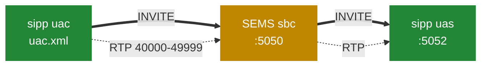

# 11.3 Відтворювана лабораторія

> [!NOTE]
> Усе тут спирається на те, що вже є в дереві: файли збірки Docker, сценарії `sipp` у
> `doc/sipp/` і зразкові конфігурації. Жодного вигаданого інструментарію, і кожну команду можна
> вставити як є.

## Зібрати

Дерево постачає Dockerfile'и для Debian 11–13, Ubuntu 22.04 і 24.04 та RHEL 7–10. Той, що для
Debian 13, — добрий орієнтир, бо він ще й показує список залежностей:

```dockerfile
FROM debian:13

RUN apt-get update && apt-get install -y \
        git \
        debhelper devscripts \
        g++ make cmake \
        python3-dev python3-pip \
        openssl libssl-dev \
        libspandsp-dev flite1-dev libspeex-dev libgsm1-dev libopus-dev \
        libsamplerate-dev libmp3lame-dev libcodec2-dev libbcg729-dev \
        libev-dev libevent-dev libxml2-dev libcurl4-openssl-dev \
        libhiredis-dev libmysqlcppconn-dev \
        cargo rustc \
    && rm -rf /var/lib/apt/lists/*
```

Цей список є картою книги. `libspandsp` — альтернативний детектор inband-DTMF
([5.5](20-dtmf-and-jitter.md)); `flite1` — синтез мовлення ([7.3](26-ivr-and-python.md));
`libsamplerate` — високоякісний ресемплер ([5.3](18-audio-pipeline.md)); `libevent` крутить
RTP-приймач ([5.2](17-rtp-stream.md)); `libspeex`, `libgsm1`, `libopus`, `libcodec2`, `libbcg729`
— кодеки ([5.4](19-codecs-and-plugins.md)); `libhiredis` і `libmysqlcppconn` — для модулів DSM
([7.2](25-dsm.md)); а `cargo`/`rustc` збирають Rust-інструменти моніторингу
([8.2](29-monitoring-and-stats.md)).

Зверніть увагу, чого там **немає**: `libzrtp`. ZRTP типово вимкнений і потребує форкнутого SDK
([9.6](36-zrtp-and-srtp.md)).

```bash
docker build -f Dockerfile-debian13 -t sems-build .
```

Збірка проганяє юніт-тести як частину образу:

```dockerfile
RUN mkdir -p build && cd build && cmake .. && make sems_tests && ./core/sems_tests
```

Тож успішний образ означає, що тести пройшли. Локально:

```bash
mkdir -p build && cd build
cmake ..
make -j"$(nproc)"
make sems_tests && ./core/sems_tests
```

Корисні опції, усі розібрані раніше:

```bash
cmake .. -DSEMS_USE_ZRTP=yes        # ZRTP, потрібен SDK
cmake .. -DSEMS_USE_TTS=yes         # flite і промовлений SAS
```

ZRTP — це [9.6](36-zrtp-and-srtp.md); промовлений SAS потребує обох прапорців разом.

> [!TIP]
> `SESSION_THREADPOOL` закоментований у `CMakeLists.txt` ([2.1](02-thread-model.md)). Якщо ви
> хочете поекспериментувати з пуловою моделлю сесій, це єдине, що треба міняти у збірці, а не в
> конфігурації.

## Лабораторія, що йде разом із SEMS

`doc/sipp/` — це повністю робочий сетап, і його `README` достатньо короткий, щоб процитувати:

```
SEMS sipp Basic Test Configuration

sems.conf:

- listening at 127.0.0.1:5050 for sip requests from uac
- using 127.0.0.1:40000-49999 for media (if rtprelay enabled)
- adjust plugin_config_path and plugin path to your sems setup

# sems -f sems.conf

uas:

- listening at 127.0.0.1:5052 for sip requests from sems

$ sipp -sf uas.xml -i 127.0.0.1 -p 5052

uac:

- makes one call to uac via sems transparent sbc

$ sipp -sf uac.xml -m 1 127.0.0.1:5050
```

Три процеси на loopback: `sipp`-викликач, SEMS із SBC і `sipp`-викликаний.



У теці також є `sbc.conf`, `monitoring.conf`, `stats.conf`, `zrtp.conf` і профіль:

```
# Transparent SBC profile

header_filter=blacklist
header_list=P-App-Name,P-App-Param

message_filter=transparent

enable_session_timer=yes
```

Малий, і кожен рядок у ньому — це [частина 6](23b-sbc-profiles.md): чорний список заголовків, що
зрізає два `P-App-*`, аби вони не витекли на B-ногу, прозора фільтрація повідомлень і ввімкнені
таймери сесії.

### Запустити

Три термінали:

```bash
# 1 — викликаний
sipp -sf doc/sipp/uas.xml -i 127.0.0.1 -p 5052

# 2 — SEMS
sems -f doc/sipp/sems.conf

# 3 — один дзвінок
sipp -sf doc/sipp/uac.xml -m 1 127.0.0.1:5050
```

`-m 1` робить один дзвінок. Приберіть його для тривалого навантаження або додайте `-r 10 -l 100`
для десяти дзвінків за секунду зі ста одночасними.

## На що дивитись під час роботи

**Рядок старту** ([2.4](05-lifecycle.md)):

```
SEMS <version> (<arch>/<os>) started
```

пишеться після завантаження плагінів і безпосередньо перед `sip_ctrl.run()`. Якщо його немає,
остання стадія, яка встигла залогуватись, покаже, де воно спинилось.

**Потоки** ([2.1](02-thread-model.md)):

```bash
ps -L -p "$(pgrep -x sems)" -o tid,pcpu,comm | head -20
watch -n1 'ps -L -p "$(pgrep -x sems)" | wc -l'
```

Під навантаженням кількість росте з одночасними дзвінками — один потік на сесію в типовій збірці.

**Цикл сесії** ([4.1](12-amsession.md)):

```bash
grep '^\^\^ S \[' /var/log/sems.log | tail -20
```

`vv S [` і `^^ S [` обрамляють кожен прохід циклу подій сесії, несучи Call-ID, local tag, статус
діалогу, незавершені UAC-транзакції й лічильник usages. Грепніть один local tag — отримаєте повне
життя одного дзвінка.

**Таблиця транзакцій** ([3.4](10-transaction-layer.md)) дампиться при зупинці:

```
** Transaction table dump: **
```

Усе, що там перелічено, було в польоті на момент зупинки.

**RTP-порти:**

```bash
ss -unlp | grep sems | wc -l
```

Проти вашого налаштованого діапазону ([10.2](38-security-media.md)).

**Зняти дзвінок** ([9.5](35-siprec-and-recording.md)) — виставте `pcap_logger` і відкрийте
результат у Wireshark; SIP і медіа лягають в один файл.

## Експерименти, які варто зробити

Кожен демонструє щось із попередніх частин, і кожен займає хвилини.

**Медіа-потоки.** Запустіть конференцію на дюжину учасників, подивіться, як насичується одне
ядро, потім виставте `media_processor_threads=4` і подивіться, як це *не* допомагає — бо
конференція є однією callgroup, а отже одним потоком ([5.1](16-media-processor.md),
[9.2](32-conference-and-mixing.md)).

**Релей проти обробки.** Прогоніть прозорий профіль SBC під навантаженням і виміряйте CPU.
Додайте щось із входом — анонс — і виміряйте знову. Це перемикнувся `requiresProcessing()`
([6.2](22-b2b-media.md)).

**Вартість кодека.** Змусьте G.711 через `exclude_payloads`, виміряйте ємність; змусьте iLBC,
виміряйте знову. Співвідношення з README — приблизно чотири до одного
([5.4](19-codecs-and-plugins.md)).

**Таймер B.** Наведіть SBC на адресу, що тихо викидає пакети, і подивіться, як сесії займають
потоки по 32 секунди кожна ([3.4](10-transaction-layer.md)).

**Затримка прибиральника.** Прогоніть сплеск коротких дзвінків і подивіться, як пам'ять відстає
від активних дзвінків на паузу `sleep(5)` ([2.3](04-memory-and-ownership.md)).

**`session_processor_threads` не робить нічого.** Виставте 200, перезапустіть, порахуйте потоки.
Без змін, бо `SESSION_THREADPOOL` не скомпільований ([2.1](02-thread-model.md)).

## Пакування

Дерево несе пакування для Debian (від buster до trixie), Ubuntu, RPM і Gentoo:

```
pkg/deb/{bullseye,bookworm,trixie,...}
pkg/rpm/{sems.spec,sems.init,sems.sysconfig}
pkg/gentoo/
```

Образ Debian збирає справжній пакет:

```dockerfile
RUN ln -s pkg/deb/trixie ./debian
```

із перевіркою версії, про яку варто знати:

```dockerfile
    if ! dpkg --compare-versions "$v" ge "$changelog"; then \
        echo "refusing to build $v: older than debian/changelog $changelog" >&2; \
        exit 1; \
    fi; \
```

Спроба зібрати версію, старішу за changelog, валить збірку, а не породжує пакет, який apt
відмовиться ставити як оновлення. Деталі — [14.2](53-whats-new.md).

## Додати проксі

Щойно лабораторія на `sipp` запрацювала, наступний крок — справжня інтеграція
([11.1](40-with-kamailio.md)): поставити попереду Kamailio, зняти SEMS із loopback і додати блок
`route[SERVICES]`, що позначає дзвінки через `P-App-Name`. Це та форма, якою користуються в
продакшені, а сценарії `sipp` продовжують працювати як генератор навантаження проти неї.
