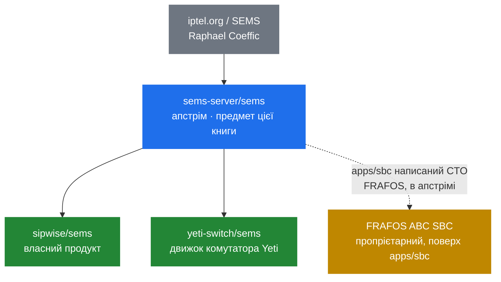

# 12.1 Родина: огляд

> [!NOTE]
> Усе дотепер описувало `sems-server/sems`. Ця частина — про інші гілки: чим кожна є, чому
> існує і що насправді різниться. Це не другий глибокий занурок: внутрішня будова з частин 2–11
> здебільшого спільна, а там, де ні, це і є сенсом відповідного розділу.

## Родовід

Зверніть увагу на пунктир. FRAFOS не є форком у тому ж сенсі, що двоє інших, і
[12.4](46-frafos-and-the-sbc.md) саме про те, чому ця відмінність важить.

## Поруч

| | `sems-server/sems` | `sipwise/sems` | `yeti-switch/sems` | FRAFOS |
|---|---|---|---|---|
| Стосунок | Апстрім | Форк, що розійшовся | Форк, що розійшовся | Контриб'ютор, потім комерційний продукт |
| Ліцензія | **Подвійна**: GPLv2+ або пропрієтарна від FRAFOS | **Чистий GPL** — свідомо | Відкритий код | Пропрієтарний продукт |
| Конфіг сумісний з апстрімом | — | Розійшовся | **Явно ні** | н/д |
| Ким рухається | Спільнотою | Платформою Sipwise NGCP | Комутатором Yeti (клас 4) | SBC-бізнесом FRAFOS |
| Документація | `doc/` у дереві, doxygen | `sems.readthedocs.io` | `yeti-switch.org/docs/sems/` | Документація продукту |
| Пакети | Debian, Ubuntu, RHEL, Gentoo у дереві | Debian, через Sipwise | Власний репозиторій Debian | Продукт |
| Помітні додатки | — | Redis/MySQL, власні docs | Модулі `yeti`, `prometheus`, `jsonrpc` | Фреймворк `apps/sbc`, в апстрімі |
| Розібрано в | Частини 1–11 | [12.2](44-fork-sipwise.md) | [12.3](45-fork-yeti-switch.md) | [12.4](46-frafos-and-the-sbc.md) |

## Питання ліцензії — найцікавіше

Апстрім **ліцензований подвійно**, і його власний `README.md` каже це прямо:

> SEMS is free (speech+beer) software. It is licensed under dual license terms, the GPL (v2+)
> and proprietary license. […] For a license to use SEMS under non-GPL terms, please contact
> FRAFOS GmbH at info@frafos.com .

Звідси дві речі.

**Комерційну ліцензію тримає FRAFOS.** Для проєкту такої форми це незвично, і пояснює це
[12.4](46-frafos-and-the-sbc.md).

**Внески мусять вписуватись у цю схему.** Подвійне ліцензування вимагає, щоб проєкт міг
переліцензувати те, що приймає, і саме тому `README.md` спершу за все відсилає контриб'юторів до
політики в `doc/COPYING`.

І саме звідси Sipwise відійшли. Їхній README каже, що вони є

> fully GPL license compatible implementation

що читається як технічна ремарка, а є ліцензійною: чистий GPL, без зобов'язань подвійного
ліцензування, без питання переліцензування для контриб'юторів. [12.2](44-fork-sipwise.md)
розбирає це.

## Що форки кажуть про апстрім

Прочитані разом, три гілки є коментарем до одного й того самого набору прогалин.

**Кращої спостережуваності потребували всі.** Yeti написали нативний модуль `prometheus`; апстрім
відповів Rust-сайдкаром, що опитує XML-RPC ([8.2](29-monitoring-and-stats.md)). Та сама проблема,
протилежна архітектура — і це найгостріший приклад питання з [13.1](47-gaps-overview.md):
всередині процесу чи поруч із ним?

**Керуючого API поза XML-RPC потребували всі.** Yeti постачає власний `jsonrpc`; в апстрімі він
теж є ([8.1](28-rpc-architecture.md)). Конвергентна еволюція, бо міст «XML-RPC у DI на рядках» —
не те, проти чого хочеться автоматизувати.

**SRTP не додав ніхто.** По всій родині шифрування медіа лишається ZRTP або нічим
([9.6](36-zrtp-and-srtp.md)). Коли три незалежні команди пропускають ту саму функцію, зазвичай це
тому, що в їхніх розгортаннях у медіа-шляху стоїть інший компонент.

**Конфігурація — те, де форки розходяться першою чергою.** Yeti прямо каже, що його формат
несумісний із mainline. Конфігурація є поверхнею, якої торкаються користувачі, тож форк
переробляє її першою, і узгодити її потім найважче.

## Що обирати

**Беріть `sems-server/sems`**, якщо будуєте власне, хочете найширші пакети або хочете саме той
код, який описує ця книга. Це референс, і саме з ним порівнюють кожну іншу гілку.

**Беріть `sipwise/sems`**, якщо крутите Sipwise NGCP або хочете кодову базу під чистим GPL без
міркувань про подвійне ліцензування. Поза NGCP ви є меншою аудиторією, ніж платформа, якій він
служить.

**Беріть `yeti-switch/sems`**, якщо розгортаєте Yeti. Інакше — ні: це компонент більшої системи, і
його конфігурація не прийме файли mainline.

**Говоріть із FRAFOS**, якщо потрібен підтримуваний комерційний SBC або не-GPL ліцензія на сам
SEMS.

> [!WARNING]
> **Не змішуйте.** Конфігураційні файли, збірки модулів і очікування не переносяться між гілками,
> і найбільш явно — для Yeti ([12.3](45-fork-yeti-switch.md)). Обрати гілку означає обрати
> екосистему, а не просто тарбол із кодом.

## Як читати решту цієї частини

Кожен розділ відповідає на чотири питання в одному порядку: чим воно є, чому форкнули, що
насправді різниться і кого це стосується.

Там, де розходження гілки змінює те, як слід читати код апстріму, це зазначено у відповідному
розділі, а не тут — інлайн-колаути `> [!NOTE]` в решті книги існують рівно для цього.
