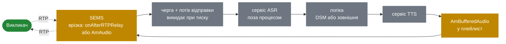

# 13.4 Форк медіа для STT і TTS

> [!IMPORTANT]
> Точки врізки **вже існують**. Бракує стрімінгового приймача: ніщо в дереві не говорить websocket
> чи gRPC, і жоден ASR-вендор не з'являється ні в `core`, ні в `apps`. Цей розділ — про те, куди б
> ви його чіпляли і, що корисніше, чого дизайн медіа-площини вам зробити не дасть.

## Що є

**TTS, файловий.** `flite_text_to_speech()` в `apps/ivr` і `apps/conference`
([7.3](26-ivr-and-python.md)) синтезує у файл, який далі грається звичайним аудіо-ланцюжком
([5.3](18-audio-pipeline.md)). Спершу синтез завершується, потім починається відтворення. Годиться
для «ваш PIN 1234»; не те, що у 2026-му мають на увазі під голосовим агентом.

**Форк медіа, через SIPREC.** `cc_siprec` форкає копію медіа на рекордер
([9.5](35-siprec-and-recording.md)), а `apps/siprec_srs` є сервером запису. Стандартний протокол,
працює сьогодні, форкає аудіо з живого дзвінка.

**Дві точки врізки.**

| Врізка | Бачить | Виконується на | Розділ |
|---|---|---|---|
| `AmAudio::read()` / `write()` | **Декодоване** лінійне аудіо | Потоці медіа-процесора, всередині тика 10 мс | [5.3](18-audio-pipeline.md) |
| `onAfterRTPRelay()` | **Закодовані** RTP-пакети | Потоці RTP-приймача | [6.5](23c-sbc-call-control.md) |

Ці дві справді різні, і вибір між ними визначає більшість дизайну.

## Обмеження, які і є сенсом цього розділу

**Жодна з врізок не має права блокуватись.** `AmAudio::read()` виконується в бюджеті 10 мс,
спільному з усіма сесіями callgroup ([5.1](16-media-processor.md)). `onAfterRTPRelay()`
виконується на потоці, що пересилає кожен релейований пакет на машині
([5.2](17-rtp-stream.md)). Синхронний мережевий запис у будь-якій із них псує звук непов'язаним
дзвінкам.

Санкціонований патерн — `async_file_writer` ([2.4](05-lifecycle.md)): покласти в чергу й
повернутись, дати іншому потоку надіслати, і **викидати, а не блокуватись**, коли черга повна.

> [!WARNING]
> Блокуюча відправка в ASR — це не повільна функція, а аварія медіа. Якщо розпізнавач повільний,
> недосяжний або тисне назад, черга мусить викидати аудіо, а дзвінок — тривати. Розпізнавання є
> best-effort; дзвінок — ні.

**Падіння є аварією.** Влінкувати вендорський SDK — gRPC, бібліотеку websocket, кодек, якого ви не
аудіювали — в однопроцесний сервер ([2.1](02-thread-model.md)) означає, що їхній баг є вашим
простоєм. Це найсильніший аргумент тримати розпізнавач поза процесом і слати йому байти.

**Зашифровані ноги невидимі.** SEMS релеїть SRTP, не дешифруючи ([9.6](36-zrtp-and-srtp.md)).
Ногу, що узгодила `RTP/SAVP`, не можна ні розпізнати, ні транскрибувати, ні записати як аудіо. Це
жорстка межа, а не питання конфігурації.

**У режимі релею декодованого аудіо немає.** З `relay_enabled` пакети не доходять до
аудіо-ланцюжка ([9.4](34-rtp-mux-and-relay.md)). Врізка в `AmAudio` вимагає повного медіа-шляху, а
це реальне зростання вартості для SBC ([6.2](22-b2b-media.md)).

## Два дизайни

### Форкати закодовані пакети

Причепитись до `onAfterRTPRelay()`, скопіювати пакет, покласти в чергу, дати іншому потоку
відправити.

- **Працює в режимі релею** — без декодування, без повного медіа-шляху, без зміни ємності.
- **Дешево**: копія і постановка в чергу.
- Приймальний бік отримує RTP і мусить сам депакетизувати, декодувати й давати раду втратам.
- Потребує інформації про кодек поза смугою, з погодженого SDP ([4.3](14-offer-answer.md)).

Саме це робить `cc_siprec`, а SIPREC уже стандартизує метадані. **Якщо вам треба витягти аудіо з
живого дзвінка сьогодні — це той шлях**, а розпізнавач сидить за сервером запису SIPREC.

### Врізатись у декодоване аудіо

Вставити в ланцюжок `AmAudio`, що пропускає семпли наскрізь і копіює їх у чергу.

- **Лінійний PCM**, уже ресемплений до спільної частоти ([5.3](18-audio-pipeline.md)) — рівно те,
  чого хоче розпізнавач.
- **Композиційно**: це просто ще один елемент ланцюжка.
- **Змушує перейти на повний медіа-шлях.** `requiresProcessing()` перемикається
  ([6.2](22-b2b-media.md)), і дзвінок коштує стільки, скільки учасник конференції.
- Приховування втрат уже відбулось ([5.5](20-dtmf-and-jitter.md)), тож розпізнавач бачить
  синтезоване аудіо на місці втрачених пакетів — зазвичай це покращення.

Обирайте це, коли дзвінок і так на повному медіа-шляху — IVR, конференція — бо вартість уже
сплачена.

## Стрімінговий синтез

Зворотний напрямок складніший, і складність структурна, а не випадкова.

Сьогоднішній шлях через `flite` пише файл і грає його ([7.3](26-ivr-and-python.md)). Стрімінговий
синтез означає, що аудіо приїжджає мережею, поки відтворення вже триває, а це потребує `AmAudio`,
чий `read()` вичерпує буфер, який годує мережа.

Складові є. `AmBufferedAudio` уже відв'язує виробника від тика
([5.3](18-audio-pipeline.md)), а `AmPlaylistSeparator` уже кладе подію, коли відтворення дійшло до
маркера ([2.2](03-event-system.md)) — саме так скрипт дізнається, що промпт догрався.

Складне — це **недобір (underrun)**. Якщо синтезатор відстає, `read()` мусить видати аудіо, а
брати його нема звідки. Варіанти: тиша, комфортний тон або повтор — і всі три чутні. У файлу
недобору не буває; у потоку — завжди може. Будь-який дизайн мусить вирішити це явно.

## Як виглядає повний конвеєр

Зверніть увагу, що всередині SEMS, а що ні. **Усе розумне живе поза процесом**, досяжне
асинхронно ([8.3](30-app-timers-and-events.md)) — і це той самий висновок, до якого
[7.4](27-app-tradeoffs.md) доходить щодо логіки застосунків загалом, із тих самих причин.

Крок логіки — природне місце для DSM ([7.2](25-dsm.md)): у нього вже є типи подій
`JsonRpcRequest` і `JsonRpcResponse`, тож потік дзвінка може порадитись із зовнішнім сервісом і
бути розбудженим відповіддю, не блокуючись. Зводьте поруч таймер
([8.3](30-app-timers-and-events.md)): сервіс, який не відповість, інакше лишить сесію чекати до
`dead_rtp_time`.

## Про затримку, чесно

Затримка туди-назад для розмовного агента є сумою: медіа-тик (10 мс), черга врізки, мережа до
розпізнавача, розпізнавання, крок логіки, синтез, мережа назад, буферизація й шлях відтворення.
SEMS належить лише перше.

Це варто сказати, бо воно локалізує проблему. SEMS додає кілька десятків мілісекунд; усе відчутне
відбувається поза ним. Оптимізувати бік SEMS — не там, де виграш.

## З чого починати

1. **Візьміть SIPREC.** Він працює сьогодні, він стандартний, і він лишає дзвінки в режимі релею
   ([9.5](35-siprec-and-recording.md)). Наведіть рекордер на свій розпізнавач.
2. **Якщо SIPREC заважкий**, напишіть модуль call control на `onAfterRTPRelay()`, що копіює в
   чергу. Малий, локалізований, без змін у ядрі ([6.5](23c-sbc-call-control.md)).
3. **Врізайтесь в `AmAudio` лише якщо дзвінок і так на повному медіа-шляху.**
4. **Тримайте розпізнавач поза процесом.** Жодного вендорського SDK усередині сервера, де падіння
   є аварією.
5. **Викидайте, ніколи не блокуйтесь.** Обидві врізки живуть на потоках, які не мають права
   стопоритись.
