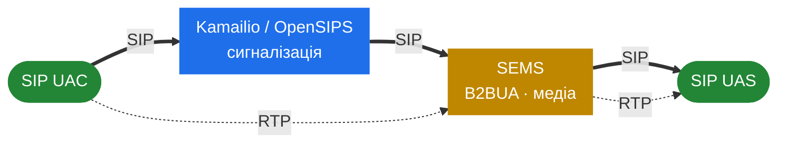

<h1 align="center">SEMS Handbook — Українська</h1>

  <em>Як SEMS влаштований усередині.</em>

  
  
  

---

> [!IMPORTANT]
> Цей хендбук — **свідомо не переказ офіційної документації**. Він припускає, що ви вже приблизно знаєте, що таке SEMS, і натомість заглиблюється в модель потоків, систему подій, ядро сесій, медіа-конвеєр, власний SIP-стек і механіку B2BUA. Тут немає довідника з конфігурації окремих застосунків.

> [!NOTE]
> Предмет цього хендбука — **[sems-server/sems](https://github.com/sems-server/sems)**, канонічний апстрім. Інші гілки родини SEMS розглядаються в [частині 12](#12-родина-sems), а поза нею — лише там, де розходження змінює те, як слід читати код апстріму.

**Використані джерела:**

- [github.com/sems-server/sems](https://github.com/sems-server/sems) — предмет опису; власне реалізація на C++ і кінцеве джерело істини.
- `doc/Readme.*.txt` і `doc/doxygen_proj` у дереві коду — поведінка застосунків і семантика конфігурації.
- [sems.readthedocs.io](https://sems.readthedocs.io/) — наративна документація.
- Тільки для **частини 12 (родина)**:
    - [github.com/sipwise/sems](https://github.com/sipwise/sems) — гілка Sipwise.
    - [github.com/yeti-switch/sems](https://github.com/yeti-switch/sems) і [yeti-switch.org/docs/sems](https://yeti-switch.org/docs/sems/) — гілка Yeti.

## Де сидить SEMS

Проксі маршрутизує сигналізацію і виходить із медіа-шляху. SEMS робить навпаки: він термінує
сигналізацію як B2BUA **і** пропускає медіа через себе. Саме навколо цього поділу побудований хендбук.

> [!TIP]
> Парний том, [Kamailio Handbook](https://denyspozniak.github.io/kamailio-handbook/), описує бік сигналізації — багатопроцесний проксі з fork-per-worker, керований конфігураційним DSL. SEMS — його дзеркальне відображення: багатопотоковий, event-driven, thread-per-session. [Частина 11.1](40-with-kamailio.md) — місце, де ці дві книги зустрічаються.

## Зміст

### 1. Передмова

- [1.1 Вступ](01-introduction.md)
- [1.2 SIP і медіа — вступний мінімум](01b-sip-media-primer.md)

### 2. Рантайм

- [2.1 Модель потоків](02-thread-model.md)
- [2.2 Система подій](03-event-system.md)
- [2.3 Пам'ять і володіння](04-memory-and-ownership.md)
- [2.4 Життєвий цикл процесу](05-lifecycle.md)
- [2.5 Сайзинг і тюнінг](06-sizing-and-tuning.md)

### 3. SIP-рівень

- [3.1 SIP-стек](07-sip-stack-overview.md)
- [3.2 Транспорт](08-transport.md)
- [3.3 Парсер](09-parser.md)
- [3.4 Транзакційний рівень](10-transaction-layer.md)
- [3.5 Рівень діалогів](11-dialog-layer.md)

### 4. Ядро сесій

- [4.1 AmSession](12-amsession.md)
- [4.2 Контейнер сесій і фабрики](13-session-container-and-factories.md)
- [4.3 Offer/answer](14-offer-answer.md)
- [4.4 Обробники подій сесії](15-session-event-handlers.md)

### 5. Медіа-площина

- [5.1 Медіа-процесор](16-media-processor.md)
- [5.2 RTP-потік](17-rtp-stream.md)
- [5.3 Аудіо-конвеєр](18-audio-pipeline.md)
- [5.4 Кодеки і плагіни](19-codecs-and-plugins.md)
- [5.5 DTMF і джитер](20-dtmf-and-jitter.md)

### 6. B2BUA

- [6.1 AmB2BSession](21-b2b-session.md)
- [6.2 B2B-медіа](22-b2b-media.md)
- [6.3 Застосунок SBC](23-sbc.md)

### 7. Фреймворк застосунків

- [7.1 Архітектура плагінів](24-plugin-architecture.md)
- [7.2 DSM](25-dsm.md)
- [7.3 IVR і Python](26-ivr-and-python.md)
- [7.4 Компроміси: C++ vs DSM vs Python](27-app-tradeoffs.md)

### 8. Control plane

- [8.1 Архітектура RPC](28-rpc-architecture.md)
- [8.2 Моніторинг і статистика](29-monitoring-and-stats.md)
- [8.3 Таймери і події застосунку](30-app-timers-and-events.md)

### 9. Архітектурні фішки

- [9.1 Клієнт реєстрації](31-registrar-client.md)
- [9.2 Конференції і мікшування](32-conference-and-mixing.md)
- [9.3 Сховище повідомлень і голосова пошта](33-msg-storage-and-voicemail.md)
- [9.4 RTP mux і релей](34-rtp-mux-and-relay.md)
- [9.5 SIPREC і запис](35-siprec-and-recording.md)
- [9.6 ZRTP і SRTP](36-zrtp-and-srtp.md)

### 10. Безпека і hardening

- [10.1 Поверхня атаки](37-security-surface.md)
- [10.2 Безпека медіа-площини](38-security-media.md)
- [10.3 Hardening](39-security-hardening.md)

### 11. SEMS у продакшені

- [11.1 SEMS разом з Kamailio](40-with-kamailio.md)
- [11.2 Топології і HA](41-topologies-and-ha.md)
- [11.3 Відтворювана лабораторія](42-lab.md)

### 12. Родина SEMS

- [12.1 Родина: огляд](43-family-overview.md)
- [12.2 sipwise/sems](44-fork-sipwise.md)
- [12.3 yeti-switch/sems](45-fork-yeti-switch.md)
- [12.4 FRAFOS і SBC](46-frafos-and-the-sbc.md)

### 13. Довідник

- [13.1 Мапа термінів](47-term-map.md)
- [13.2 Що нового у 2.x](48-whats-new.md)
